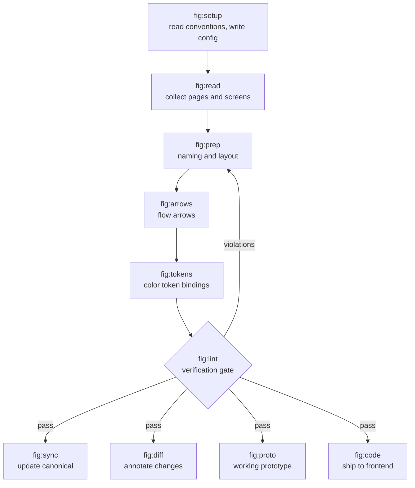

# fig

[한국어](README.md) · **English**

Claude Code skills for **operating** existing Figma files — tidying, verifying, and syncing them. Not for drawing new screens, but for keeping a file that several people share from decaying.

Where the official Figma plugin (`figma-use`, `figma-generate-design`) handles **creation**, this handles **upkeep**. It runs on top of that plugin.

```bash
claude plugin marketplace add byjunyoung/claude-figma-skills
claude plugin install fig@byjunyoung
```

---

## Why this exists

A design file you use alone never rots. The trouble starts when several people share it, the screen count passes a few hundred, and a few months go by.

- You duplicate a screen and **settings from the original come along for the ride**, leaving empty slots rendered. Zoomed out you cannot see them, so nobody notices until an engineer asks
- The build already shipped, but **the canonical Figma page still shows the old screen**. The next person designs against it
- You move screens and **the flow arrows no longer line up.** Redrawing by hand is tedious, so they stay broken
- "What shows up in this case?" an engineer asks. **That is when you learn you never drew that screen**

None of these are catchable by eye, and by the time they are, fixing them is expensive. This toolkit catches them **numerically, before handoff.**

## Three design rules

**Verification happens in exactly one place.** The skills that modify files (`prep`, `arrows`, `sync`) contain no checking code. Only `/fig:lint` decides whether something is wrong; the rest just fix what it reports. When verification is scattered across skills, you get a gap that reads "I wasn't using that skill this time, so I skipped the audit."

**Conventions are observed, not asked for.** Every team names screens differently, spaces them differently, groups sections differently. `/fig:setup` does not ask — it **reads the file and works it out**, because people answer from memory and get their own team's rules wrong.

**When unsure, leave it blank.** If an observation is thin or split, the value stays `null`, which means that check is skipped. Not knowing a rule and breaking a rule are different things, and mixing them buries the report in false positives until nobody reads it.

## How it fits together



---

## When you reach for it

### Starting on a file you have never seen

```
/fig:setup    read the file, derive that team's conventions, draft a config
/fig:read     collect every page and screen
```

Running checks before you know the conventions flags everything. That is why config comes first. Once you have a draft, run `/fig:lint` once and **judge it by the false-positive rate** — if nearly everything is flagged, the file is not a mess; the config is wrong.

### You finished a feature's screens and it is going to engineering

```
/fig:prep     unify names · group into sections · stub missing screens
/fig:arrows   connect screens with labeled flow arrows
/fig:lint     check structure, flow, and components in one pass
```

`prep` notices that "there is a list screen but no empty-result screen" and reserves the spot. Surfacing it before an engineer asks is the whole point. Nothing ships until `lint` passes.

### You built a new screen by duplicating an existing one

```
/fig:lint     detect component defaults dragged in by the copy
```

A display toggle that is on in the library stays on even where the screen does not use it, rendering an empty slot. **You will never see this in a zoomed-out screenshot.** The check works by sampling how the file's existing screens actually use that component, so it needs no rulebook.

### The build shipped but the canonical Figma page is stale

```
/fig:sync     audit what reached canonical → apply → archive the working copy
```

The working copy and the canonical page **use identical screen names**, so comparing names tells you nothing. It judges on three signals together: the text inside screens, screen height, and component links. When the structure matches it edits values in place rather than moving frames, so deep links from specs and tickets survive.

### The task is editing existing screens and you must communicate what changed

```
/fig:diff     dev-mode annotation pins on changed elements + a comparison table in the task doc
```

Only the representative screen gets pinned; state variants inherit. Pinning every variant buries the real change.

### You want to check the flow makes sense before engineering starts

```
/fig:proto    rebuild the design as a single HTML file that actually accepts input
```

Not a click-through of screenshots — you type a value, save, and it appears in the list. Pressing through it surfaces "wait, this order is odd" that the static design hid.

### Bringing the design into code

```
/fig:code     comparison table → minimal edits → typecheck · browser · screenshot diff → PR
```

It separates what the design owns (values, color, copy, states) from what the repo owns (file structure, naming, state management), so neither overwrites the other.

---

## Skills

| Command | What it does |
|---|---|
| `/fig:setup` | Observe conventions, draft a config |
| `/fig:read` | Collect pages and screens |
| `/fig:prep` | Unify names · group sections · stub missing screens |
| `/fig:arrows` | Create and re-sync flow arrows |
| `/fig:lint` | Read-only verification gate (zero writes) |
| `/fig:tokens` | Audit color bindings against design-system tokens |
| `/fig:sync` | Audit what reached canonical → apply → archive |
| `/fig:diff` | Annotate changes · write up the task doc |
| `/fig:proto` | Working single-file HTML prototype |
| `/fig:code` | Apply the design to a frontend repo |

### What `/fig:lint` looks at

| Area | Problems it catches |
|---|---|
| Structure | Screens outside their section · out of section bounds · overlapping screens · naming violations · section numbering out of step with layout |
| Flow | Arrows cutting through unrelated screens · arrowheads pointing into empty space · screens absent from every flow · labels covering an arrowhead or another line |
| Components | Settings dragged in by duplication, leaving empty slots rendered |

Arrowhead direction is not catchable by distance alone. An arrow can sit exactly 12px from its target and still point into empty space if that last segment runs **parallel** to the edge. So the final segment is checked for perpendicularity separately.

---

## Install

```bash
claude plugin marketplace add byjunyoung/claude-figma-skills
claude plugin install fig@byjunyoung
```

Updating is one line: `claude plugin marketplace update byjunyoung`.

- **Requires** — Claude Code, the Figma MCP plugin (`plugin:figma`), `python3` + PyYAML, `node`
- **Verify** — `fig@byjunyoung` should appear in `claude plugin list`
- **After installing** — run `/fig:setup` against your file first to generate a config

## Configuration

Rules live in a single `figma-conventions.yaml`, not in the skill documents. Naming patterns, state lists, spacing tokens, section styling, arrow styling, sections to exclude, and tolerances are all there.

```
./figma-conventions.yaml              per project (wins if present)
      ↓ otherwise
~/.claude/figma-conventions.yaml      your shared config
      ↓ otherwise
bundled defaults                      → the report says "running on defaults"
```

- **First run** — `/fig:setup` observes your file and drafts the config
- **What `null` means** — not inferred, so that check is skipped
- **Per-file values** — things that differ by file, like which pages are canonical versus archive, go under `files.<fileKey>`

## Layout

```
.claude-plugin/
  plugin.json                name, version, author
  marketplace.json           marketplace entry
skills/
  setup  read  prep  arrows  lint
  tokens sync  diff  proto   code      one SKILL.md each
_figma-common/
  conventions.example.yaml   config schema + bundled defaults
  verify.py                  consistency check
  scripts/
    audit-struct.js          membership · bounds · overlap · naming · order
    audit-flow.js            arrow geometry · entry angle · crossings · labels · coverage
    audit-component.js       component default residue
    arrow-build.js           arrow-building helpers
    prep-ops.js              page-tidying helpers
    probe-page.js            convention observation
    lib/                     config resolution · draft generation · syntax gate
```

The Figma plugin sandbox has no file system. Config resolution therefore happens on the host: `resolve-config.py --js <fileKey>` prints one line that gets prepended to the script. Script paths are rooted at `${CLAUDE_PLUGIN_ROOT}`, since the install location differs per machine.

After editing a skill, run `python3 ${CLAUDE_PLUGIN_ROOT}/_figma-common/verify.py`.

## Built with

Claude Code skills (Markdown) + Figma Plugin API (JavaScript) + config resolution and aggregation (Python). PyYAML is the only external dependency.

## Author

Junyoung Kim · [LinkedIn](https://www.linkedin.com/in/byjunyoung/)

## License

© 2026 Junyoung Kim · [LICENSE](LICENSE)

**You are free to install and use it** — personally or inside your team — and to modify it for your own use.

**Forking to redistribute, republishing it under your own name, or reselling it commercially requires permission.** That is why no standard open-source license is attached. Ask via [Issues](https://github.com/byjunyoung/claude-figma-skills/issues) or LinkedIn if you need it.

## Feedback

Bug reports and feature requests are welcome in [Issues](https://github.com/byjunyoung/claude-figma-skills/issues).
