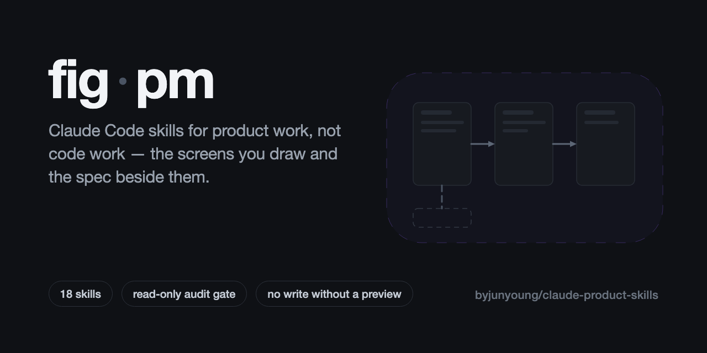
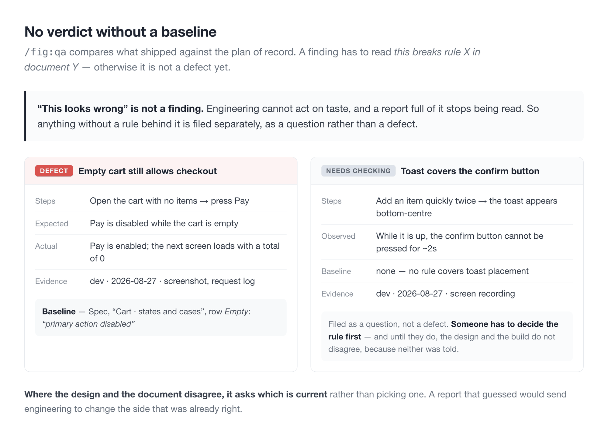
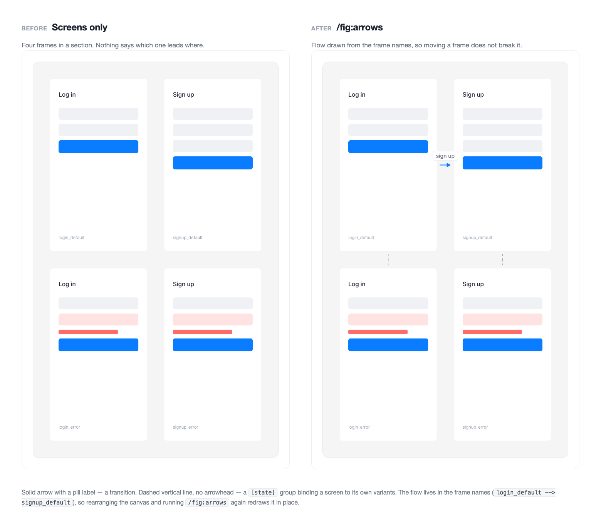
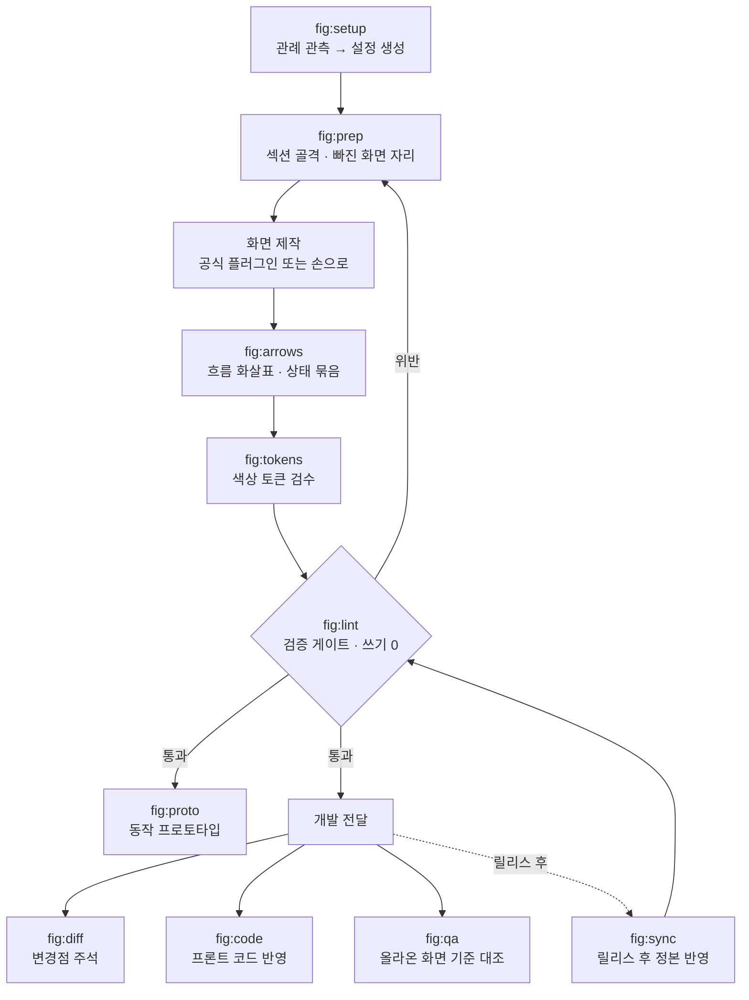
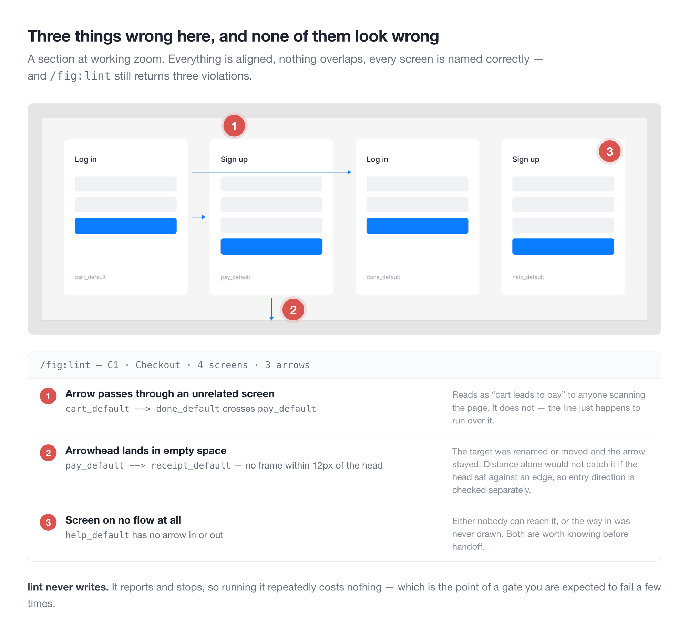
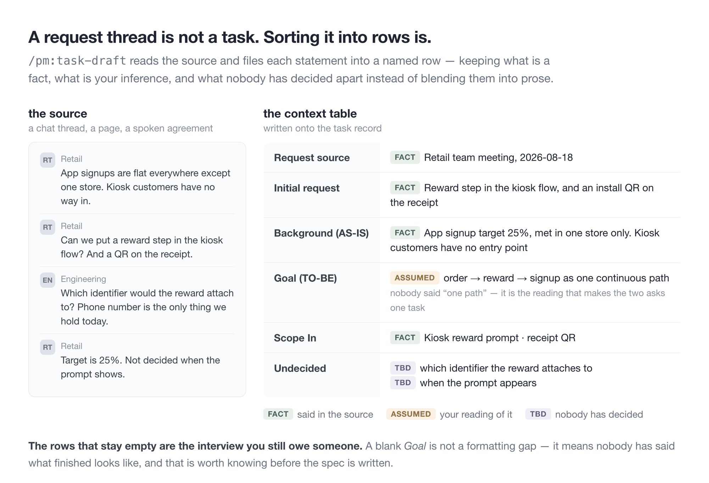
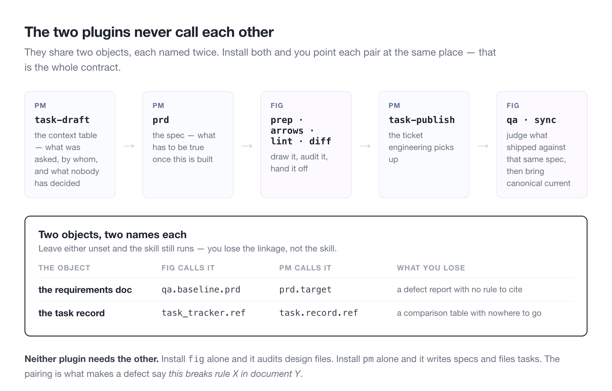
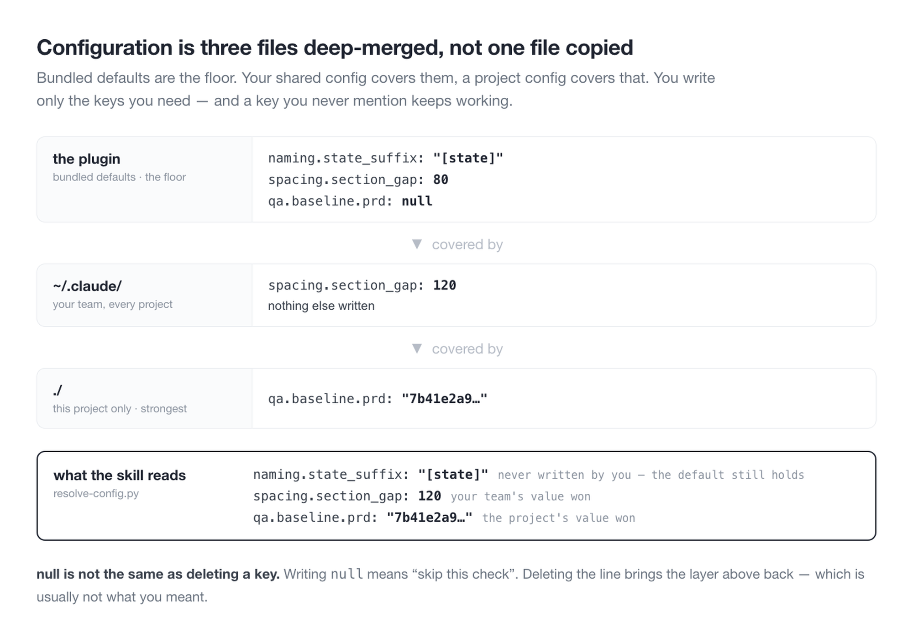

# fig · pm

**한국어** · [English](README.md)

Claude Code 스킬은 대개 코드를 향해 있습니다. 이 둘은 그 옆의 일을 향합니다. 화면을 그리는 Figma 파일과, 그 옆에 쓰는 기획 문서. 한 저장소에 있고 설치는 따로 갑니다.

| 플러그인 | 무엇을 | 스킬 |
|---|---|---|
| **fig** | 화면 그리는 일의 앞뒤 전부 — 그릴 목록 만들기, 검증, 정본 동기화 | 13 |
| **pm** | 기획 문서를 쓰고 검증하고, 거기서 나온 일감을 잡아 등록·정합 | 5 |

```bash
claude plugin marketplace add byjunyoung/claude-product-skills
claude plugin install fig@byjunyoung
claude plugin install pm@byjunyoung      # 기획 문서까지 쓸 때
```

둘은 서로를 필요로 하지 않습니다. 아래는 대부분 `fig` 이야기이고, `pm`은 [따로 정리해 뒀습니다](#pm--기획-문서). 둘 다 쓸 때 맞춰야 할 설정 두 개는 [둘이 만나는 지점](#둘이-만나는-지점)에 있습니다.

[어떤 자리에 서는 도구인가](#어떤-자리에-서는-도구인가) · [누가 쓰면 좋은가](#누가-쓰면-좋은가) · [무엇을 해결하나](#무엇을-해결하나) · [어떻게 쓰나](#어떻게-쓰나) · [스킬 열세 개](#스킬-열세-개) · [시작하기](#시작하기) · [설정](#설정) · [막혔을 때](#막혔을-때) · [설계 원칙](#설계-원칙) · [pm](#pm--기획-문서) · [둘이 만나는 지점](#둘이-만나는-지점)

---

## 어떤 자리에 서는 도구인가

Figma를 다루는 도구는 크게 둘로 갈립니다. 화면 안을 그려내는 쪽과, 그 앞뒤를 맡는 쪽.

공식 Figma 플러그인(`figma-use`, `figma-generate-design`, `figma-generate-library`)이 앞쪽입니다. 코드나 설명을 받아 화면과 컴포넌트를 만들어냅니다.

이 묶음은 뒤쪽입니다. 그리기 전에는 섹션 골격을 잡고 빠진 상태를 점선 껍데기로 세워 그릴 목록을 만들고, 그린 뒤에는 이름이 규칙에 맞는지, 화면이 제자리에 있는지, 흐름 화살표가 실제로 이어지는지, 개발에 나간 변경이 정본에 반영됐는지를 검사하고 고칩니다. 공식 플러그인 위에서 동작하니 둘을 같이 씁니다.

화면 안을 그리는 일은 공식 플러그인이, 그 앞뒤는 이 묶음이 맡습니다.

## 누가 쓰면 좋은가

디자이너와, 그 옆에서 기획 문서를 쓰는 사람을 위한 것입니다.

파일 하나를 여러 사람이 오래 고쳐 쓰는 팀에 맞습니다. 새로 그리는 작업이든 그려둔 것을 고치는 작업이든 상관없습니다.

- 화면이 수백 개 쌓인 파일을 여럿이 함께 고치는 팀
- 새 기능 화면을 한 벌 그려 개발에 넘기는 사이클이 반복되는 자리
- 개발에 넘긴 시안과 Figma 정본을 계속 맞춰야 하는 자리
- 파일 관리 규칙은 있는데 지켜지는지 확인할 방법이 없는 팀

새로 그리는 작업에서는 이렇게 붙습니다. 화면 안을 그리는 것은 공식 플러그인이 맡고, 이 묶음은 그 앞뒤를 맡습니다.

```
그리기 전   섹션 골격을 잡고, 빠진 상태를 점선 껍데기로 세워 그릴 목록을 만든다
그리는 중   화면을 복제해 변형을 만들 때 딸려온 설정 잔재를 검출한다
다 그린 뒤  전환 화살표와 상태 묶음을 연결하고, 검사를 통과해야 넘긴다
```

안 맞는 경우도 적어둡니다.

- 화면 한두 장짜리 단발 작업이면 손으로 하는 편이 빠릅니다
- 컴포넌트 라이브러리를 처음부터 만드는 일은 공식 `figma-generate-library` 쪽입니다
- 규칙이 아직 없는 팀은 `/fig:setup`이 관례를 못 뽑습니다. 먼저 몇 가지를 정하는 편이 낫습니다

## 무엇을 해결하나

디자인 파일은 혼자 쓰면 잘 안 망가집니다. 문제는 사람이 여럿이고, 화면이 수백 개가 되고, 몇 달이 지났을 때 생깁니다. 네 가지가 반복됩니다.

- **복제 잔재** — 화면을 복제해 새로 만들면 원본 설정이 딸려옵니다. 안 쓰는 표시 토글이 켜진 채 남아 내용 없는 빈 자리가 렌더됩니다. 축소된 화면에서는 보이지 않습니다
- **정본 지연** — 개발은 이미 배포됐는데 Figma 정본은 옛날 그대로입니다. 다음 사람이 옛 화면을 보고 기획합니다
- **어긋난 화살표** — 화면을 옮기면 흐름 화살표가 따라오지 않습니다. 손으로 다시 그리는 비용 때문에 그냥 둡니다
- **안 그린 화면** — "이 경우엔 뭐가 나오나요?" 개발이 물어서야 그 화면을 안 그렸다는 것을 압니다

네 가지 다 눈으로는 안 잡힙니다. 잡히더라도 고칠 때쯤이면 이미 개발이 물어본 뒤입니다. 이 묶음은 그것을 수치로 검사해 미리 잡습니다.

---

## 어떻게 쓰나

세 가지 리듬으로 씁니다. 기능 하나를 그려 넘기는 한 사이클, 릴리스마다 도는 정본 맞추기, 그리고 아무 때나 돌리는 건강검진.

### 한 사이클 — 기능 하나를 그려 넘길 때까지

```
/fig:setup    처음 여는 파일이면 관례를 관측해 설정 초안을 만든다
/fig:prep     섹션 골격을 잡고, 빠진 상태를 점선 껍데기로 세운다
   ·          화면을 그린다 (공식 플러그인 또는 손으로)
/fig:arrows   전환 화살표와 상태 묶음을 연결한다
/fig:lint     구조 · 흐름 · 컴포넌트를 한 번에 검사한다
/fig:diff     기존 화면을 고친 일감이면 변경점에 주석 핀을 박는다
```

`prep`이 먼저 오는 이유는 그릴 목록을 만들기 위해서입니다. 목록 화면을 그리면 결과 없을 때 화면이 필요하고, 폼을 그리면 검증 실패 화면이 필요합니다. 이것을 점선 껍데기로 먼저 세워두면 빠진 화면이 눈에 보입니다. 개발이 물어보기 전에 드러나는 것이 핵심입니다.


`lint`는 통과해야 넘기는 관문입니다. 파일을 쓰지 않으니 몇 번을 돌려도 안전합니다.

### 주기 작업 — 릴리스가 나간 뒤 정본 맞추기

```
/fig:sync     작업분이 정본에 반영됐는지 전수 대조 → 반영 → 아카이브 이관
```

작업본과 정본은 화면 이름이 똑같아서 이름 비교로는 뭐가 빠졌는지 알 수 없습니다. 화면 안의 글자, 화면 높이, 컴포넌트 연결 세 가지를 함께 보고 판정합니다.

구조가 같으면 화면을 통째로 옮기지 않고 값만 고칩니다. 노드 id가 유지돼 기획서나 티켓에 걸어둔 딥링크가 안 끊깁니다.

### 수시 — 파일 건강검진

```
/fig:lint     구조 · 흐름 · 컴포넌트 검사 (쓰기 0)
/fig:tokens   색이 디자인시스템 토큰에 묶여 있는지 검수
```

파일을 안 고치니 아무 때나 돌려도 됩니다. 남이 만진 파일을 넘겨받았을 때, 오래된 파일을 다시 열었을 때 먼저 한 번 돌려보면 상태를 알 수 있습니다.

### 곁가지 두 개

```
/fig:proto    개발 착수 전, 시안을 실제로 입력 · 저장되는 단일 HTML로 재현
/fig:code     시안을 프론트엔드 레포에 반영
/fig:qa       올라온 화면을 기획 기준과 대조해 결함 리포트
/fig:deck     문서·데이터를 발표 덱으로 (자산은 deck-setup 이 먼저)
```

`proto`는 화면을 클릭해 넘기는 데모가 아닙니다. 값을 넣고 저장하면 목록에 반영됩니다. 눌러보면 시안에서는 안 보이던 순서 문제가 드러납니다.

`deck`은 문서 하나를 발표 흐름으로 옮겨 Figma Slides 덱을 짓습니다. 팀 템플릿의 좌표·색·타이포를 그대로 쓰는 게 원칙이라, 카탈로그에 없는 형태가 나와도 레이아웃을 지어내지 않고 가장 가까운 아키타입에 맞춰 내용을 줄이거나 장을 쪼갭니다. 템플릿 값은 `/fig:deck-setup`이 실측해 로컬에 뽑아둡니다 — 워드마크가 박힌 배경 이미지가 딸려 오므로 배포본에는 안 실립니다.

`qa`는 개발 서버에 올라온 화면을 기획 기준과 대조합니다. "이상해 보인다"가 아니라 "어느 문서의 어느 규칙에 어긋난다"로 적는 게 원칙이라, 기준이 없는 항목은 결함이 아니라 확인 필요로 분리합니다.



`code`는 시안이 기준인 것(수치·색·문구·상태)과 코드가 기준인 것(파일 구조·이름 짓는 방식·상태 관리)을 갈라서, 어느 한쪽이 다른 쪽을 덮어쓰지 않게 합니다.

### 실제로 어떻게 보이나



### 전체 흐름



---

## 스킬 열세 개

| 명령 | 무엇을 |
|---|---|
| `/fig:setup` | 파일 관례를 관측해 설정 초안 생성 |
| `/fig:read` | 페이지·화면 목록 수집 |
| `/fig:prep` | 이름 통일 · 섹션 배치 · 누락 화면 placeholder |
| `/fig:arrows` | 흐름 화살표 생성과 재동기화 |
| `/fig:lint` | 읽기 전용 검증 게이트 (쓰기 0) |
| `/fig:tokens` | 색상의 디자인시스템 토큰 바인딩 검수 |
| `/fig:sync` | 정본 반영 전수 감사 → 반영 → 이관 |
| `/fig:diff` | 변경점 주석 표기 · 일감 문서 정리 |
| `/fig:proto` | 동작하는 단일 HTML 프로토타입 |
| `/fig:code` | 프론트엔드 레포 코드 반영 |
| `/fig:qa` | 올라온 화면을 기획 기준과 대조해 결함 리포트 |
| `/fig:deck-setup` | 팀 발표 템플릿을 실측해 덱 자산 생성 |
| `/fig:deck` | 소스를 발표 덱(Figma Slides)으로 |

### `/fig:lint`가 보는 것

| 무엇을 | 어떤 문제를 잡나 |
|---|---|
| 구조 | 화면이 섹션 밖으로 빠짐 · 섹션 경계 이탈 · 화면끼리 겹침 · 이름 규칙 위반 · 섹션 순번과 배치 불일치 |
| 흐름 | 화살표가 엉뚱한 화면을 관통 · 화살촉이 허공을 가리킴 · 어떤 흐름에도 안 걸린 화면 · 라벨이 화살촉이나 다른 선을 가림 |
| 컴포넌트 | 복제할 때 딸려온 불필요한 설정이 남아 빈자리가 렌더됨 |



화살촉 방향은 거리만 재면 안 잡힙니다. 12px 떨어져 있어도 도착 변에 평행하면 화살촉이 옆 허공을 가리킵니다. 그래서 마지막 선분이 도착 변에 수직인지를 따로 봅니다.

컴포넌트 검사는 규칙 문서가 없어도 동작합니다. 같은 파일의 기존 화면들이 그 컴포넌트를 어떻게 쓰는지 분포를 뽑아 대조하는 방식입니다.

---

## pm — 기획 문서

문서와 거기서 나오는 일을 함께 다루는 별도 플러그인입니다.

| | |
|---|---|
| `/pm:setup` | 쓰는 도구들의 스키마를 읽어 설정 초안 — 손으로 못 찾는 id 포함 |
| `/pm:prd` | 요구사항 문서를 양식에 맞춰 쓰고, 내기 전에 검증 |
| `/pm:task-draft` | 요청 스레드를 일감 맥락표로 |
| `/pm:task-publish` | 그 일감을 개발 트래커에 티켓으로 등록 |
| `/pm:task-sync` | 기획 목록과 그 트래커를 정합 |

### 한 바퀴 — 요청에서 티켓까지

```
/pm:setup          워크스페이스를 처음 열 때, 스키마를 읽어 설정 초안
/pm:task-draft     요청 스레드를 일감 맥락 행으로 갈라 담기
/pm:prd            기능·정책 항목 — 만들고 나면 무엇이 참이어야 하는지
/pm:task-publish   범위가 정해지면 티켓으로 등록
/pm:task-sync      가끔, 목록 전체를 트래커와 맞춤
```

`task-draft`가 `prd`보다 앞인 건, 맥락표가 「기획서를 쓸 만큼 재료가 있나」를 알려주기 때문입니다. 끝까지 안 채워진 행이 아직 물어야 할 것입니다.



`task-publish`는 한 건을, `task-sync`는 목록을 맡습니다. 나눠 둔 이유는 실패하는 방식이 다르기 때문입니다. 한 건은 잘못 등록돼서 망가지고, 목록은 어긋나면서 망가집니다 — 미등록, 중복, 부모 오연결, 부활. 어긋남을 진단하려면 양쪽을 먼저 읽어야 해서, `sync`는 쓰지 않고 진단을 먼저 보여준 뒤 멈춥니다.

**일감 쪽은 트래커를 전제하지 않습니다.** 한 곳에서 기획하고 개발하는 팀은 `task.mirror.type: none`으로 두면 `/pm:task-sync`가 「정합할 게 없다」고 답합니다 — 오류가 아니라 맞는 답입니다. 기획과 개발이 갈린 팀은 양쪽을 적고, 매칭은 티켓 URL을 담은 속성 **하나로만** 합니다. 티켓 본문의 역링크는 매칭에 쓰지 않습니다 — 폐기된 옛 소스를 가리킬 수 있고, 중복과 부활이 거기서 나옵니다.

**저장 대상을 안 가립니다.** 골격은 어디에 쓰든 같고, `prd.target`이 발행 방식만 가릅니다.

```
markdown   로컬 파일. 기본값 — 다른 도구가 필요 없다
git        마크다운으로 쓰고 브랜치·PR 까지
notion     Notion 페이지. prd.notion 절을 채워야 동작
```

지키는 것이 셋입니다.

**모호함을 남기지 않습니다.** 판정·집계의 단위, 필터·정렬의 대상, '대표' 선정 기준, 상태 전환의 정의 — 이 넷이 비면 기능이 성립하지 않으니 값으로 채웁니다. 자료로 정할 수 있는데 TBD로 둔 칸이 하나라도 있으면 검증을 통과시키지 않습니다.

**기획 문서를 개발 문서로 만들지 않습니다.** `forbidden_terms`에 적힌 말이 본문에 있으면 반려합니다. "무엇(요구)"까지만 쓰고 "어떻게(구현)"는 개발에 위임하거나 TBD로 둡니다.

**쓰기 전에 멈춥니다.** 검증은 읽기 전용이고, 발행은 미리보기 → "go" 뒤에만, 그것도 뼈대 → 사용자 그룹 → 기능 항목으로 쪼개서 합니다.

설정은 `pm-conventions.yaml`입니다. `fig`와 같은 방식으로 겹쳐 읽습니다.

---

## 둘이 만나는 지점

두 플러그인은 서로를 부르지 않습니다. 공유하는 건 대상 두 개뿐이고, 그 둘이 `figma-conventions.yaml`과 `pm-conventions.yaml`에 각각 한 번씩 이름을 갖습니다. **둘 다 설치했다면 짝마다 같은 곳을 가리키게 두세요.**

| 대상 | `fig`에서 부르는 이름 | `pm`에서 부르는 이름 |
|---|---|---|
| 요구사항 문서 | `qa.baseline.prd` | `prd.target`과 `prd.notion` 절 |
| 일감 레코드 | `task_tracker.ref` | `task.record.ref` |

계약은 이게 전부이고, 각각 이유가 있습니다. `/fig:qa`에 기획서가 필요한 건 결함 보고가 「Y 문서의 X 규칙을 어겼다」로 읽힐 때만 넘길 값이 있기 때문입니다 — 그 Y 문서를 쓴 게 `/pm:prd`입니다. `/fig:diff`에 일감이 필요한 건 AS-IS/TO-BE 표가 그걸 부른 요청 옆에 있어야 하기 때문입니다 — 그 레코드를 연 게 `/pm:task-draft`입니다.

둘 다 필수는 아닙니다. `qa.baseline.prd`를 `null`로 두면 `/fig:qa`는 전부 결함이 아니라 확인 필요로 올립니다. `task_tracker.type`을 `none`으로 두면 `/fig:diff`는 표를 마크다운으로 뱉습니다. 잃는 건 연결이지 기능이 아닙니다.

풀어 그리면 기능 하나가 이렇게 한 바퀴 돕니다.



그리고 다음 요청이 다시 시작합니다. 이번엔 정본이 최신인 상태로.

---

## 시작하기

### 미리 있어야 하는 것

| 무엇 | 왜 |
|---|---|
| **Claude Code** | Claude Code 플러그인입니다 |
| **Figma MCP 플러그인**(`plugin:figma`) | `fig` 스킬은 전부 이걸 거쳐 Figma를 읽고 씁니다. 응답하는지 먼저 확인하세요 |
| **평소 쓰는 Figma 파일** | `/fig:setup`은 실제 파일을 재서 관례를 뽑습니다. 빈 파일은 관측할 게 없습니다 |
| **`python3` + PyYAML, `node`** | 설정 해석은 호스트에서 돌고, 감사 스크립트는 `node --check`로 문법을 봅니다 |
| **Figma 개인 액세스 토큰** *(선택)* | `/fig:read`만 씁니다. 페이지를 전수로 훑을 때 REST API가 필요해서인데, 없으면 MCP로 물러나 일부 페이지만 보일 수 있습니다 |

`pm`은 Figma 쪽이 하나도 필요 없습니다. 기획 문서만 쓴다면 그것만 깔면 됩니다.

### 1. 설치

```bash
claude plugin marketplace add byjunyoung/claude-product-skills
claude plugin install fig@byjunyoung
claude plugin install pm@byjunyoung      # 기획 문서도 쓴다면
```

`claude plugin list`에 `fig@byjunyoung`이 보이면 된 것입니다. 나중에 갱신은 `claude plugin marketplace update byjunyoung`.

### 2. 파일을 읽게 한다

```
/fig:setup <Figma 파일 URL>
```

Figma에는 아무것도 쓰지 않습니다. 이 파일이 프레임 이름을 어떻게 짓는지, 섹션 간격을 얼마로 두는지, 화살표를 어떤 스타일로 그리는지를 세어 최빈값을 관례로 잡고, **못 정한 건 추측하지 않고 `null`로 둡니다.** 표본이 얇거나 값이 갈리면 `null`이 되고, 그건 채워 넣는 대신 물어봅니다.

초안은 `~/.claude/figma-conventions.yaml`에 떨어집니다. 플러그인을 지웠다 깔아도 남는 자리입니다. 프로젝트 안에 두고 싶으면 `out: ./figma-conventions.yaml`로 지정하세요.

받아들이기 전에 줄 주석을 읽어보세요. 근거가 붙어 있습니다 — `24/69 (35%)`는 69번 관측 중 24번 나왔다는 뜻이고, 그래서 그 값이 `null`이 된 것입니다.

### 3. 첫 검증을 읽는다

`/fig:setup`은 마지막에 `/fig:lint`까지 돌려 줍니다. **위반 건수가 아니라 오탐 비율로 읽으세요.**

거의 모든 프레임이 걸렸다면 파일이 아니라 설정이 틀린 것입니다. 걸리게 만든 패턴을 느슨하게 하거나 `null`로 검사를 끄면 됩니다. 봤을 때 "이건 진짜네" 싶은 게 몇 건 나오면 맞게 잡힌 것입니다.

여기까지가 세팅입니다. 이후 흐름은 [어떻게 쓰나](#어떻게-쓰나)에 있습니다.

## 설정

규칙은 스킬 문서가 아니라 `figma-conventions.yaml` 하나가 정합니다. 화면 이름 규칙, 상태 목록, 간격 값, 섹션 스타일, 화살표 스타일, 검사에서 뺄 섹션, 허용 오차가 모두 여기 있습니다.



전체 스키마는 [`conventions.example.yaml`](plugins/fig/_common/conventions.example.yaml)에 있습니다. 14개 절, 112개 항목이고 값마다 무엇을 검사하는지 주석이 붙어 있어 그대로 복사해 고쳐 쓰면 됩니다. 생긴 모양은 이렇습니다.

```yaml
naming:
  frame: "{screen}-{state}"           # 사람이 읽을 형태
  frame_pattern: '^.+-[^-\s]+$'       # lint 가 그대로 정규식으로 쓴다
  states: [Default, Empty, Loading, Error, Validation, Selected]
  required_states:
    list: [Default, Empty, Loading, Error]

pages:
  strict:   ['^\[UI\] ']              # 규칙 전면 적용
  exclude_sections: ['^템플릿$']       # 검사 면제

layout:
  column_grid: 1560
  frame_gap: 120

arrows:
  color: "#4A5463"
  audit: { edge_tolerance: 2, gap_range: [9, 15] }
```

- **첫 실행** — 대상 파일에서 `/fig:setup`을 돌리면 관례를 관측해 초안을 만듭니다
- **부분만 적어도 됩니다** — 세 층을 겹쳐 읽습니다. 안 적은 키는 기본값이 채우고, 적은 키만 덮입니다
- **`null`의 의미** — 추정하지 않았다는 뜻이고, 해당 검사를 건너뜁니다. 검사를 끄려면 키를 지우지 말고 `null`을 적으세요 — 지우면 기본값이 살아납니다
- **파일별 설정** — 정본·아카이브 페이지 구분처럼 파일마다 다른 항목은 `files.<fileKey>`에 적습니다

초안이 나오면 `/fig:lint`를 한 번 돌려 오탐률로 검증합니다. 위반이 전건에 가까우면 파일이 잘못된 게 아니라 설정이 틀린 것입니다.

---

## 막혔을 때

**리포트에 "기본값으로 진행"이 찍힙니다.**
설정 파일이 아예 안 읽히고 있습니다. 프로젝트 폴더에서 `python3 plugins/fig/_common/scripts/lib/resolve-config.py --where`를 돌리면 실제로 찾은 파일을 찍어 줍니다. 대개 파일명 오타이거나, `~/.claude/`가 아닌 데 놓여 있습니다.

**파일 전체가 위반으로 나옵니다.**
파일이 아니라 설정이 틀린 것입니다. 네이밍 패턴이 너무 빡빡하면 이렇게 됩니다 — 상태 접미사를 라틴 문자로 제한한 패턴은 한글 이름을 전건 오탐합니다. 패턴을 느슨하게 하거나 `null`로 그 검사를 끄세요.

**스킬을 고쳤는데 안 바뀝니다.**
설치본은 `plugins/cache/<마켓>/<플러그인>/<버전>/`에 버전으로 고정돼 있습니다. `plugin.json`의 버전을 그대로 두면 마켓을 갱신해도 설치본은 옛 코드를 계속 씁니다. 버전을 올리고 → `claude plugin marketplace update` → uninstall·install 순입니다.

**`check.sh`에서 `Permission denied`가 납니다.**
GitHub Contents API로 올라간 파일에는 실행 비트가 안 따라옵니다. 직접 실행하지 말고 `bash <경로>`로 부르세요.

**Figma 토큰 요청이 401로 돌아옵니다.**
401은 "토큰 없음"·"만료"·"무효"가 다 같이 나오는 코드입니다. `/fig:read`는 환경변수 존재 여부를 먼저 보고 호출하므로, 401이 떴다면 값은 있는데 거부됐다는 뜻입니다. Figma Security 탭에서 재발급하세요.

**`/fig:read`가 페이지를 일부만 가져옵니다.**
REST 경로가 아니라 MCP 폴백으로 돈 것입니다. fileKey만 준 `get_metadata`는 데스크톱 앱의 열린 파일·뷰포트에 묶입니다. 전수로 훑으려면 REST가 필요하고, REST에는 토큰이 필요합니다.

**`/fig:deck`이 "자산 없음"으로 멈춥니다.**
`/fig:deck-setup`을 먼저 돌리세요. 팀 슬라이드 템플릿을 실측해 `~/.claude/deck-assets`에 만들어 줍니다. 플러그인에는 템플릿 값이 하나도 안 들어 있습니다 — 덱 배경에 회사 워드마크가 박혀 있어 배포할 수 없기 때문입니다.

**덱 폰트가 다르게 나옵니다.**
이 환경에 팀 폰트가 없습니다. 빌드가 `FAMS`의 후보를 순서대로 찔러 다음 것으로 물러나는데, 그러면 자간이 달라집니다. 폰트를 깔거나, 대체 폰트를 받아들이고 줄이 어디서 꺾이는지 다시 보세요.

**리포트가 원하는 언어로 안 나옵니다.**
`meta.language`가 정합니다. `auto`는 대화 언어를 따르고, `ko`·`en` 같은 태그를 적으면 고정됩니다. 스킬 본문이 영어인 것과는 상관없습니다.

**컨펌 없이 뭔가 써졌습니다.**
외부 쓰기는 Figma 노드든 기획 페이지든 브랜치든 전부 미리보기 → "go"를 거칩니다. 그게 없이 실행됐다면 버그이니 [알려주세요](https://github.com/byjunyoung/claude-product-skills/issues).

---

## 설계 원칙

**검증은 한 곳에서만 합니다.** 파일을 고치는 스킬(`prep`·`arrows`·`sync`)에는 검사 코드가 없습니다. 맞는지 틀린지 판정하는 것은 `/fig:lint` 하나뿐이고, 나머지는 지적된 것을 고치는 역할만 맡습니다. 검증이 스킬마다 흩어져 있으면 "이번엔 그 스킬을 안 써서 검사를 건너뛰었다"는 구멍이 생기기 때문입니다.

**규칙은 묻지 않고 관측합니다.** 팀마다 화면 이름 붙이는 법도, 간격도, 섹션 묶는 단위도 다릅니다. `/fig:setup`은 그것을 물어보지 않고 파일을 직접 훑어서 알아냅니다. 사람은 자기 팀 규칙도 기억으로 답하면 틀리기 때문입니다.

**모르면 비워둡니다.** 관측 결과가 애매하면, 즉 표본이 적거나 값이 반반으로 갈리면 채우지 않고 `null`로 둡니다. `null`은 그 검사를 건너뛴다는 뜻입니다. 규칙을 모르는 것과 규칙을 어긴 것은 다르고, 둘을 섞으면 리포트가 오탐에 묻혀 아무도 안 읽게 됩니다.

## 구조

```
.claude-plugin/
  marketplace.json             마켓플레이스 항목 (플러그인 목록)
plugins/
  fig/
    .claude-plugin/plugin.json
    README.md
    skills/
      setup  read  prep  arrows  lint
      tokens sync  diff  proto   code    각 SKILL.md
    _common/
      conventions.example.yaml           설정 스키마 + 내장 기본값
      scripts/
        audit-struct.js                  소속·경계·겹침·네이밍·순번
        audit-flow.js                    화살표 수치·진입방향·관통·라벨·커버리지
        audit-component.js               컴포넌트 기본값 잔재
        arrow-build.js                   화살표 생성 헬퍼
        prep-ops.js                      페이지 정리 헬퍼
        probe-page.js                    관례 관측
        lib/                             설정 해석·초안 생성·문법 검사
tools/
  verify.py                    정합성 검사 (저장소 도구, 설치본에는 안 실림)
```

한 저장소가 플러그인 여럿을 담습니다. `marketplace.json`의 `plugins`가 배열이라, 설치는 따로 가면서 저장소·검사기는 한 벌만 관리합니다.

Figma 플러그인은 파일 시스템에 접근할 수 없습니다. 그래서 설정 해석은 로컬에서 처리하고, `resolve-config.py --js <fileKey>`가 출력한 한 줄을 스크립트 앞에 붙여 실행합니다. 스크립트 경로는 `${CLAUDE_PLUGIN_ROOT}` 기준입니다. 설치 위치가 환경마다 다르기 때문입니다.

스킬을 수정한 뒤에는 저장소에서 `python3 tools/verify.py`로 정합성을 확인합니다. 마켓플레이스에 등록된 플러그인을 전부 검사하고, 플러그인 사이에 사본으로 도는 파일이 갈렸는지도 함께 봅니다.

## 기술 스택

Claude Code 스킬(Markdown) + Figma Plugin API(JavaScript) + 설정 해석·집계(Python). 외부 의존성은 PyYAML 하나입니다.

## 만든 사람

김준영 · [LinkedIn](https://www.linkedin.com/in/byjunyoung/)

## 라이선스

© 2026 Junyoung Kim · [LICENSE](LICENSE)

설치해서 쓰는 것은 자유입니다. 개인이든 팀 안에서든 쓰고, 필요하면 고쳐 써도 됩니다.

포크해서 재배포하거나, 다른 이름으로 다시 배포하거나, 상업적으로 재판매하는 것은 허락이 필요합니다. 정식 오픈소스 라이선스를 붙이지 않은 이유입니다. 문의는 [Issues](https://github.com/byjunyoung/claude-product-skills/issues)나 링크드인으로 남겨주세요.

## 피드백

버그 제보나 기능 제안은 [Issues](https://github.com/byjunyoung/claude-product-skills/issues)에 남겨주세요.
