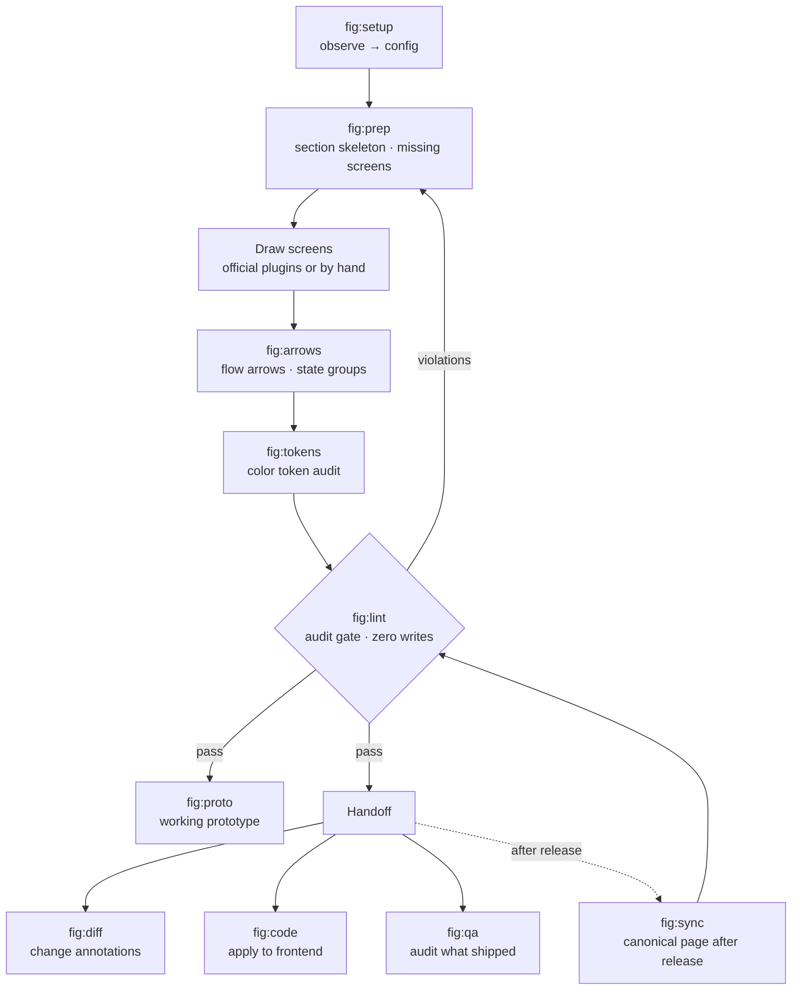

# fig · pm

[한국어](README.ko.md) · **English**

Two Claude Code skill bundles — one for design files, one for product docs. They share a repo and install separately.

| Plugin | What it does | Skills |
|---|---|---|
| **fig** | Organize, audit, and sync Figma files that already exist | 13 |
| **pm** | Write and verify product requirement docs against a format | 1 |

```bash
claude plugin marketplace add byjunyoung/claude-product-skills
claude plugin install fig@byjunyoung
claude plugin install pm@byjunyoung      # if you also write specs
```

Most of what follows is about `fig`. `pm` has [its own section](#pm--product-docs).

[Where it fits](#where-it-fits) · [Who it's for](#who-its-for) · [What it solves](#what-it-solves) · [How you use it](#how-you-use-it) · [The thirteen skills](#the-thirteen-skills) · [Getting started](#getting-started) · [Configuration](#configuration) · [Troubleshooting](#troubleshooting) · [Design principles](#design-principles) · [pm](#pm--product-docs)

---

## Where it fits

Figma tooling splits into two halves: the half that draws screens, and the half that keeps drawn files in order.

Figma's official plugins (`figma-use`, `figma-generate-design`, `figma-generate-library`) are the first half. Give them code or a description and they produce screens and components.

This bundle is the second half. It works on files that already exist — checking whether names follow the convention, whether screens sit where they belong, whether flow arrows actually connect, whether changes shipped to engineering made it back into the canonical page. It runs on top of the official plugins, so you use both.

Drawing is the official plugins' job. What happens around the drawing is this bundle's.

## Who it's for

Teams where one file is edited by several people over a long time. It doesn't matter whether you're drawing new screens or revising old ones.

- Teams sharing a file that has grown to hundreds of screens
- Anyone who repeats the cycle of drawing a feature's screens and handing them to engineering
- Anyone who has to keep handed-off designs and the canonical Figma page in step
- Teams that have file conventions but no way to check whether they're followed

Here's where it attaches when you're drawing something new. The official plugins draw what's inside a screen; this bundle handles what comes before and after.

```
Before   Lay out the section skeleton, stub missing states as dashed placeholders — that stub list is your to-draw list
During   Catch settings that tagged along when you duplicated a screen to make a variant
After    Wire up transition arrows and state groups, then pass the audit before handing off
```

Where it isn't the right tool:

- A one-off job of a screen or two is faster by hand
- Building a component library from scratch belongs to the official `figma-generate-library`
- If your team has no conventions yet, `/fig:setup` has nothing to observe. Settle a few of them first

## What it solves

A design file rarely breaks when one person owns it. It breaks when there are several people, hundreds of screens, and a few months of history. Four things recur.

- **Duplication residue** — duplicate a screen to make a new one and the original's settings come along. An unused display toggle stays on, rendering an empty slot with nothing in it. It's invisible at zoomed-out scale
- **Stale canonical page** — engineering has already shipped, but the canonical Figma page still shows the old screen. The next person plans against it
- **Broken arrows** — move a screen and its flow arrows don't follow. Redrawing by hand costs enough that people leave them
- **The screen nobody drew** — "what shows up in this case?" You find out that screen doesn't exist when engineering asks

None of the four is catchable by eye, and by the time you do catch one, engineering has already asked. This bundle measures for them instead.

---

## How you use it

Three rhythms: the cycle of drawing and handing off one feature, the per-release pass that keeps the canonical page current, and a health check you can run any time.

### The cycle — drawing one feature through handoff

```
/fig:setup    First time in a file, observe its conventions and draft a config
/fig:prep     Lay out the section skeleton, stub missing states as placeholders
   ·          Draw the screens (official plugins, or by hand)
/fig:arrows   Wire transition arrows and state groups
/fig:lint     Audit structure, flow, and components in one pass
/fig:diff     For revisions to existing screens, pin change annotations
```

`prep` comes first because it builds the to-draw list. A list screen needs an empty state; a form needs a validation-failure state. Stub those as dashed placeholders and the gaps become visible. The point is that they surface before engineering asks.

`lint` is the gate you have to pass. It never writes to the file, so running it repeatedly is safe.

### Per release — bringing the canonical page current

```
/fig:sync     Full audit of what made it into canonical → apply → archive
```

Working copies and the canonical page use identical screen names, so comparing names tells you nothing about what's missing. The audit judges on three signals together: the text inside a screen, the screen's height, and its component links.

When the structure matches, it edits values rather than replacing the whole screen. Node ids survive, so deep links from specs and tickets keep working.

### Any time — a file health check

```
/fig:lint     Structure, flow, and component audit (zero writes)
/fig:tokens   Check that colors are bound to design system tokens
```

Neither touches the file. Run one when you inherit a file someone else has been in, or when you reopen something old, and you'll know where it stands.

### Two side branches

```
/fig:proto    Before engineering starts, rebuild the design as a single HTML page that really accepts input and saves
/fig:code     Apply the design to a frontend repo
/fig:qa       Audit a shipped screen against the spec and report defects
/fig:deck     Turn a document into a deck (run deck-setup first)
```

`proto` isn't a click-through demo. Enter a value, save it, and it shows up in the list. Clicking through surfaces ordering problems that a static design hides.

`deck` moves one source document into a presentation flow and builds a Figma Slides deck. It uses the team template's coordinates, colors and type as-is — when a content shape isn't in the catalog it never invents a layout, it fits the nearest archetype by trimming content or splitting the slide. `/fig:deck-setup` measures those values into local assets, which stay out of the published plugin since template backgrounds carry company wordmarks.

`qa` audits what actually shipped against the spec. The rule is that a finding reads "this breaks rule X in document Y", never "this looks off" — anything without a baseline is filed as needs-checking rather than a defect.

`code` separates what the design owns (numbers, colors, copy, states) from what the code owns (file structure, naming, state management), so neither overwrites the other.

### What it looks like


### The whole flow



---

## The thirteen skills

| Command | What it does |
|---|---|
| `/fig:setup` | Observe a file's conventions and draft a config |
| `/fig:read` | Collect the page and screen inventory |
| `/fig:prep` | Normalize names · place into sections · stub missing screens |
| `/fig:arrows` | Create and re-sync flow arrows |
| `/fig:lint` | Read-only audit gate (zero writes) |
| `/fig:tokens` | Audit design system token binding for colors |
| `/fig:sync` | Full canonical-page audit → apply → archive |
| `/fig:diff` | Annotate changes · write up the task doc |
| `/fig:proto` | Working single-file HTML prototype |
| `/fig:code` | Apply the design to a frontend repo |
| `/fig:qa` | Audit a shipped screen against the spec and report defects |
| `/fig:deck-setup` | Measure a team slide template into local deck assets |
| `/fig:deck` | Turn a source document into a Figma Slides deck |

### What `/fig:lint` looks at

| Area | What it catches |
|---|---|
| Structure | Screens outside any section · screens past section bounds · overlapping screens · naming violations · section number vs. placement mismatch |
| Flow | Arrows cutting through unrelated screens · arrowheads pointing at empty space · screens on no flow at all · labels covering an arrowhead or another line |
| Components | Settings that tagged along in a duplicate, leaving an empty slot rendered |

Arrowhead direction isn't catchable by distance alone. An arrow can sit 12px away and still point into empty space if its last segment runs parallel to the target edge. So the audit checks perpendicularity separately.

The component audit works without any written convention. It derives the usage distribution from how other screens in the same file use that component, and compares against it.

---

## pm — product docs

A separate plugin for writing requirement docs against a format and verifying them before they ship. One skill so far: `/pm:prd`.

**It doesn't care where the doc lives.** The structure is the same everywhere; `prd.target` only changes how it's published.

```
markdown   local files. the default — no other tooling required
git        writes markdown, then branch and PR
notion     Notion pages. requires the prd.notion section
```

Three things it holds to.

**No leftover vagueness.** The unit a decision is made in, what a filter or sort acts on, how a "primary" item is chosen, what a state transition means — a feature doesn't hold together without these, so they get concrete values. If any field could have been settled from the material and was left as TBD, verification fails.

**A product doc is not an engineering doc.** Anything in `forbidden_terms` appearing in the body is rejected. It writes *what* is required and leaves *how* to engineering or to a TBD.

**It stops before writing.** Verification is read-only, publishing happens only after a preview and an explicit go, and even then in stages — skeleton, then user groups, then feature entries.

Configuration lives in `pm-conventions.yaml`, layered the same way as `fig`.

---

## Getting started

### Prerequisites

| What | Why |
|---|---|
| **Claude Code** | These are Claude Code plugins |
| **The Figma MCP plugin** (`plugin:figma`) | Every `fig` skill reads and writes Figma through it. Confirm it answers before going further |
| **A Figma file you already work in** | `/fig:setup` infers conventions by measuring a real file. An empty one has nothing to observe |
| **`python3` with PyYAML, and `node`** | Config resolution runs on the host, and the audit scripts are syntax-checked with `node --check` |
| **A Figma personal access token** *(optional)* | Only `/fig:read` needs one, to enumerate every page over the REST API. Without it, it falls back to the MCP and may see only some pages |

`pm` needs none of the Figma side. If you only write specs, install it alone.

### 1. Install

```bash
claude plugin marketplace add byjunyoung/claude-product-skills
claude plugin install fig@byjunyoung
claude plugin install pm@byjunyoung      # only if you write specs
```

`claude plugin list` should now show `fig@byjunyoung`. To update later: `claude plugin marketplace update byjunyoung`.

### 2. Let it read your file

```
/fig:setup <your figma file URL>
```

Nothing is written to Figma — this step only reads. It counts how the file already names frames, spaces sections, and styles arrows, takes the dominant value as the convention, and **leaves anything it can't settle as `null` rather than guessing.** A thin sample or a split vote produces a `null`, and it asks you about those rather than filling them in.

The draft lands in `~/.claude/figma-conventions.yaml`, which survives uninstalling and reinstalling the plugin. Pass `out: ./figma-conventions.yaml` instead for a project-local one.

Read the line comments before you accept it. They carry the evidence — `24/69 (35%)` means the value turned up in 24 of 69 observations, which is why that one came back `null`.

### 3. Judge the first audit

`/fig:setup` finishes by running `/fig:lint` for you. **Read the result by its false-positive rate, not its violation count.**

If nearly every frame is flagged, the config is wrong and the file is fine — go loosen whichever pattern is doing the flagging, or set it to `null` to switch that check off. A handful of violations that you recognise as real means it's calibrated.

That's setup done. [How you use it](#how-you-use-it) covers the loop from here.

## Configuration

Conventions live in one file, `figma-conventions.yaml`, not in the skill docs. Screen naming, the state list, spacing values, section style, arrow style, sections excluded from audit, and tolerances are all there.

```
plugin defaults                       base layer
      ↓ overridden by
~/.claude/figma-conventions.yaml      your shared config
      ↓ overridden by
./figma-conventions.yaml              per project (wins)
```

The full schema lives in [`conventions.example.yaml`](plugins/fig/_common/conventions.example.yaml) — 14 sections, 112 keys, each commented with what it governs, so you can copy it and edit in place. It looks like this:

```yaml
naming:
  frame: "{screen}-{state}"           # human-readable form
  frame_pattern: '^.+-[^-\s]+$'       # lint uses this as a regex directly
  states: [Default, Empty, Loading, Error, Validation, Selected]
  required_states:
    list: [Default, Empty, Loading, Error]

pages:
  strict:   ['^\[UI\] ']              # full rules apply
  exclude_sections: ['^Template$']    # exempt from audit

layout:
  column_grid: 1560
  frame_gap: 120

arrows:
  color: "#4A5463"
  audit: { edge_tolerance: 2, gap_range: [9, 15] }
```

- **First run** — `/fig:setup` in the target file observes its conventions and drafts one
- **Partial configs are fine** — the three layers are merged, so keys you omit fall back to defaults and only what you write is overridden
- **What `null` means** — the value wasn't inferred, so that check is skipped. To disable a check, write `null` rather than deleting the key — deleting it brings the default back
- **Per-file settings** — things that differ by file, like which pages are canonical vs. archive, go under `files.<fileKey>`

Once you have a draft, run `/fig:lint` once and judge it by the false-positive rate. If nearly everything is flagged, the config is wrong, not the file.

---

## Troubleshooting

**The report says it ran on defaults.**
Your config isn't being read at all. Run `python3 plugins/fig/_common/scripts/lib/resolve-config.py --where` from your project directory — it prints the files it actually found. Usually it's a filename typo, or the file sitting somewhere other than `~/.claude/`.

**Everything in the file comes back as a violation.**
The config is wrong, not the file. An over-strict naming pattern does this: one that limits a state suffix to Latin characters flags every non-Latin name in the file. Loosen the pattern, or set it to `null` to switch that check off entirely.

**I changed a skill and nothing changed.**
An installed plugin is pinned by version at `plugins/cache/<marketplace>/<plugin>/<version>/`. Leave the version in `plugin.json` alone and updating the marketplace still leaves the installed copy running the old code. Bump the version first, then `claude plugin marketplace update`, then uninstall and reinstall.

**`check.sh` gives `Permission denied`.**
Files shipped through the GitHub Contents API don't carry the executable bit. Call it as `bash <path>` rather than executing it directly.

**A Figma token request comes back 401.**
401 covers "no token", "expired", and "invalid" alike. `/fig:read` checks whether the environment variable exists before it calls, so a 401 means the value is present and was rejected — reissue the token in Figma's Security tab.

**`/fig:read` only returns some of the pages.**
That's the MCP fallback rather than the REST path. `get_metadata` with a fileKey alone is bound to the desktop app's open file and viewport. Enumerating every page needs REST, which needs a token.

**`/fig:deck` says there are no assets.**
Run `/fig:deck-setup` first — it measures your team's slide template into `~/.claude/deck-assets`. The plugin ships no template values at all, because deck backgrounds carry company wordmarks and can't be distributed.

**A deck came out in the wrong font.**
Your team font isn't installed in this environment. The build probes the candidates in `FAMS` in order and falls back to the next one, which changes the letter-spacing. Install the font, or accept the substitute and re-check where the lines break.

**Reports come out in the wrong language.**
`meta.language` decides it. `auto` follows whichever language you're talking in; a tag like `ko` or `en` pins it. The skill bodies being in English has no bearing on the output.

**A skill wrote something you didn't expect.**
Every external write — Figma nodes, a spec page, a branch — goes through a preview and an explicit go. If one happened without that, it's a bug worth [reporting](https://github.com/byjunyoung/claude-product-skills/issues).

---

## Design principles

**One place decides.** The skills that write to files (`prep`, `arrows`, `sync`) contain no audit code. `/fig:lint` is the only thing that judges right from wrong; everything else just fixes what it flagged. Spread the checks across skills and you get a gap — "I skipped that skill this time, so the check never ran."

**Conventions are observed, not asked.** Every team names screens differently, spaces them differently, groups sections differently. `/fig:setup` doesn't ask — it reads the file and works it out. People get their own team's conventions wrong when answering from memory.

**When unsure, leave it empty.** If the observation is ambiguous, meaning too few samples or a near-even split, the value stays `null` instead of being filled in. `null` means that check is skipped. Not knowing a rule and breaking a rule are different things, and mixing them buries the report in false positives until nobody reads it.

## Layout

```
.claude-plugin/
  marketplace.json             marketplace entry (plugin list)
plugins/
  fig/
    .claude-plugin/plugin.json
    README.md
    skills/
      setup  read  prep  arrows  lint
      tokens sync  diff  proto   code    one SKILL.md each
    _common/
      conventions.example.yaml           config schema + bundled defaults
      scripts/
        audit-struct.js                  membership, bounds, overlap, naming, ordering
        audit-flow.js                    arrow geometry, entry direction, pass-through, labels, coverage
        audit-component.js               component default residue
        arrow-build.js                   arrow construction helper
        prep-ops.js                      page cleanup helper
        probe-page.js                    convention observation
        lib/                             config resolution, draft generation, syntax check
tools/
  verify.py                    consistency check (repo tool, not shipped)
```

One repo holds several plugins. `plugins` in `marketplace.json` is an array, so they install separately while sharing one repo and one checker.

Figma plugins have no filesystem access. So config resolution happens locally: `resolve-config.py --js <fileKey>` emits a single line that gets prepended to the script before it runs. Script paths are relative to `${CLAUDE_PLUGIN_ROOT}`, since install locations differ between environments.

After editing a skill, run `python3 tools/verify.py` from the repo root. It checks every plugin listed in the marketplace, and flags shared files that have drifted apart between them.

## Built with

Claude Code skills (Markdown) + the Figma Plugin API (JavaScript) + config resolution and aggregation (Python). PyYAML is the only external dependency.

## Author

Junyoung Kim · [LinkedIn](https://www.linkedin.com/in/byjunyoung/)

## License

© 2026 Junyoung Kim · [LICENSE](LICENSE)

Installing and using it is free. Use it personally or inside your organization, and modify it if you need to.

Redistributing a fork, republishing it under another name, or reselling it commercially requires permission. That's why there's no standard open source license attached. Reach me through [Issues](https://github.com/byjunyoung/claude-product-skills/issues) or LinkedIn.

## Feedback

Bug reports and feature ideas go in [Issues](https://github.com/byjunyoung/claude-product-skills/issues).
