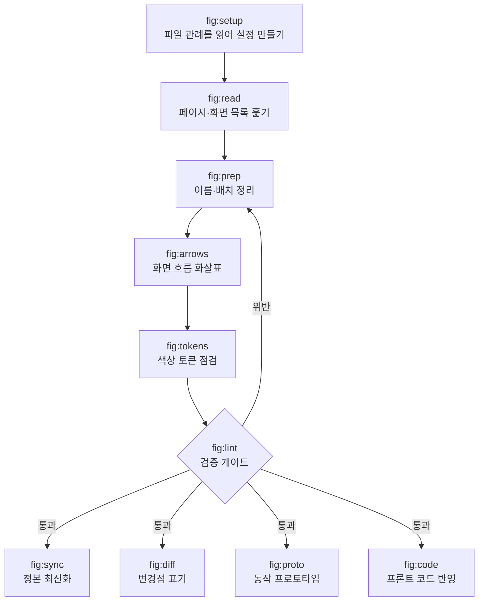

# claude-figma-skills

Claude Code에서 Figma 파일을 정리·검증·동기화하는 스킬 모음. 화면을 새로 만드는 쪽이 아니라, 여러 사람이 함께 쓰는 파일을 관리하는 쪽입니다.

공식 Figma 플러그인(`figma-use`·`figma-generate-design`)이 **생성**을 맡는다면 이쪽은 **운영**을 맡습니다. 공식 플러그인 위에서 동작합니다.

---

## 전체 흐름



파일을 고치는 스킬에는 검증 코드가 없습니다. **맞는지 틀린지 판정하는 것은 `/fig:lint` 하나뿐**이고, 나머지는 지적된 것을 고치는 역할만 맡습니다. 검증이 스킬마다 흩어져 있으면 "이번엔 그 스킬을 안 써서 검사를 건너뛰었다"는 구멍이 생기기 때문입니다.

---

## 스킬

### 시작하기 전에

**`/fig:setup`** — 처음 설치했다면 이것부터 실행합니다.

팀마다 Figma 쓰는 방식이 다릅니다. 화면 이름을 어떻게 붙이는지, 섹션을 어떤 단위로 묶는지, 화면 사이 간격을 얼마로 두는지 전부 다르죠. 이 스킬은 **대상 파일을 직접 훑어서 그 관례를 알아냅니다.** 물어보는 게 아니라 실제 노드에서 관측합니다. 사람은 자기 팀 규칙도 기억으로 답하면 틀리기 때문입니다.

관측 결과가 애매하면(표본이 적거나 값이 반반으로 갈리면) 값을 채우지 않고 비워둡니다. 모르는 것을 아는 척하면 이후 검사가 전부 헛돌기 때문입니다.

**`/fig:read`** — 파일 URL 하나만 주면 페이지와 화면 목록을 전부 뽑아옵니다.

Figma 데스크톱에서 프레임을 일일이 클릭해 고를 필요가 없습니다. 처음 보는 파일의 전체 구조를 파악하거나, 기획 전에 어떤 화면이 이미 있는지 확인할 때 씁니다.

### 파일 다듬기

**`/fig:prep`** — 본격적인 작업 전에 파일을 정돈합니다.

세 가지를 합니다. 화면 이름을 규칙대로 통일하고, 흩어진 화면을 기능 단위로 묶어 섹션에 배치하고, **빠진 화면을 찾아 빈 껍데기(placeholder)로 채워둡니다.** 예를 들어 목록 화면은 있는데 "결과가 하나도 없을 때" 화면이 없다면, 그 자리를 점선 프레임으로 잡아둡니다. 나중에 개발이 "이 경우엔 뭐가 나오나요?"라고 물어보기 전에 미리 드러내는 것입니다.

**`/fig:arrows`** — 화면 사이를 잇는 흐름 화살표를 그립니다.

"로그인 화면에서 저장을 누르면 완료 화면으로 간다"를 화살표와 라벨로 표시합니다. 손으로 그리면 화면을 옮길 때마다 화살표가 어긋나는데, 이 스킬은 **흐름 정보를 화살표 이름에 저장해두기 때문에** 화면을 재배치한 뒤 "화살표 정리해줘" 한 마디로 전부 다시 맞춥니다.

**`/fig:tokens`** — 화면에 쓰인 색이 디자인시스템 변수에 제대로 연결됐는지 검사합니다.

색을 직접 입력해버리면 나중에 테마를 바꾸거나 브랜드 색을 조정할 때 화면을 하나하나 손봐야 합니다. 이 스킬은 연결이 빠진 색을 찾아내고, **같은 파일에서 이미 쓰이고 있는 값을 근거로** 어느 토큰에 연결하면 되는지 제안합니다. 색이 실제로 바뀌게 되는 경우는 따로 표시해서 임의로 바꾸지 않습니다.

**`/fig:lint`** — 파일을 읽기만 하고 잘못된 곳을 찾아 보고합니다. 파일은 절대 건드리지 않습니다.

세 가지를 한 번에 봅니다.

| 무엇을 | 어떤 문제를 잡나 |
|---|---|
| 구조 | 화면이 섹션 밖으로 빠져나갔거나, 섹션 경계를 벗어났거나, 서로 겹쳐 있는 경우 |
| 흐름 | 화살표가 엉뚱한 화면을 관통하거나, 화살촉이 허공을 가리키거나, 어떤 흐름에도 안 걸린 화면이 있는 경우 |
| 컴포넌트 | 화면을 복사해 만들 때 딸려온 불필요한 설정이 남아 빈자리가 렌더되는 경우 |

마지막 항목이 특히 눈으로는 안 잡힙니다. 축소된 화면에서는 빈 아이콘 자리가 보이지 않아서, 수치로 검사해야만 발견됩니다.

### 작업이 끝난 뒤

**`/fig:sync`** — 작업한 내용이 운영 중인 화면(정본)에 실제로 반영됐는지 전부 대조합니다.

개발 반영과 Figma 정본 갱신은 보통 다른 시점에 일어납니다. 그 사이가 벌어진 채로 방치되면 개발이나 QA가 옛날 화면을 보고 판단하게 됩니다. 문제는 **작업본과 정본의 화면 이름이 똑같아서** 이름만 비교해서는 뭐가 반영됐는지 알 수 없다는 점입니다. 그래서 화면 안의 글자, 화면 높이, 컴포넌트 연결 세 가지를 함께 보고 판정합니다.

**`/fig:diff`** — 개선 전후 시안을 비교해 바뀐 곳을 표시합니다.

바뀐 요소마다 Figma 개발 모드의 주석 핀을 달고, 같은 내용을 일감 문서에 비교표로 정리합니다. 일감 도구는 Notion·GitHub·없음 중에 고를 수 있고, 없음이면 Figma 표시까지만 하고 비교표는 그냥 텍스트로 내줍니다.

### 코드로 옮길 때

**`/fig:proto`** — 시안을 진짜 눌러볼 수 있는 프로토타입으로 만듭니다.

화면을 클릭해 넘기는 데모가 아니라, **값을 입력하고 저장하면 목록에 반영되는** 물건입니다. 파일 하나짜리 HTML이라 더블클릭하면 바로 열립니다. 개발 착수 전에 흐름이 실제로 말이 되는지 눌러보며 확인할 때 씁니다.

**`/fig:code`** — 시안을 실제 프론트엔드 코드에 반영합니다.

시안이 기준인 것(수치·색·문구·상태)과 코드가 기준인 것(파일 구조·이름 짓는 방식·상태 관리 방식)을 구분해서, 어느 한쪽이 다른 쪽을 덮어쓰지 않게 합니다. 값을 맞췄는지 확인하고, 화면을 나란히 놓고 눈으로도 비교한 뒤 브랜치와 PR로 냅니다.

---

## 설치

```bash
claude plugin marketplace add byjunyoung/claude-figma-skills
claude plugin install fig@byjunyoung
```

갱신은 `claude plugin marketplace update byjunyoung` 한 줄입니다.

- **필요한 것** — Claude Code, Figma MCP 플러그인(`plugin:figma`), `python3` + PyYAML, `node`
- **설치 확인** — `claude plugin list` 에 `fig@byjunyoung` 이 보이면 됩니다
- **설치 뒤** — 대상 파일에서 `/fig:setup` 을 먼저 돌려 설정을 만드세요

## 설정

규칙은 스킬 문서가 아니라 `figma-conventions.yaml` 하나가 정합니다. 화면 이름 규칙, 상태 목록, 간격 값, 섹션 스타일, 화살표 스타일, 검사에서 뺄 섹션, 허용 오차가 모두 여기 있습니다.

```
./figma-conventions.yaml              프로젝트별 (있으면 이걸 씀)
      ↓ 없으면
~/.claude/figma-conventions.yaml      내 공통 설정
      ↓ 없으면
_figma-common/conventions.example.yaml   내장 기본값 → 리포트에 "기본값으로 진행" 표시
```

- **첫 실행** — 대상 파일에서 `/fig:setup`을 돌리면 관례를 관측해 초안을 만듭니다
- **`null`의 의미** — 추정하지 않았다는 뜻이고, 해당 검사를 건너뜁니다. 규칙을 모르는 것과 규칙을 어긴 것은 다르기 때문입니다
- **파일별 설정** — 정본·아카이브 페이지 구분처럼 파일마다 다른 항목은 `files.<fileKey>`에 적습니다

## 구조

```
.claude-plugin/
  plugin.json                플러그인 이름·버전·author
  marketplace.json           마켓플레이스 항목
skills/
  setup  read  prep  arrows  lint
  tokens sync  diff  proto   code      각 SKILL.md
_figma-common/
  conventions.example.yaml   설정 스키마 + 내장 기본값
  verify.py                  정합성 검사
  scripts/
    audit-struct.js          소속·경계·겹침·네이밍·순번
    audit-flow.js            화살표 수치·진입방향·관통·라벨·커버리지
    audit-component.js       컴포넌트 기본값 잔재
    arrow-build.js           화살표 생성 헬퍼
    prep-ops.js              페이지 정리 헬퍼
    probe-page.js            관례 관측
    lib/                     설정 해석·초안 생성·문법 검사
```

Figma 플러그인은 파일 시스템에 접근할 수 없습니다. 그래서 설정 해석은 로컬에서 처리하고, `resolve-config.py --js <fileKey>` 가 출력한 한 줄을 스크립트 앞에 붙여 실행합니다. 스크립트 경로는 `${CLAUDE_PLUGIN_ROOT}` 기준입니다 — 설치 위치가 환경마다 다르기 때문입니다.

스킬을 수정한 뒤에는 `python3 ${CLAUDE_PLUGIN_ROOT}/_figma-common/verify.py` 로 정합성을 확인합니다.

## 기술 스택

Claude Code 스킬(Markdown) + Figma Plugin API(JavaScript) + 설정 해석·집계(Python). 외부 의존성은 PyYAML 하나입니다.

## 만든 사람

김준영 · [LinkedIn](https://www.linkedin.com/in/byjunyoung/)

© 2026 Junyoung Kim. 별도 라이선스를 두지 않았습니다.

## 피드백

버그 제보나 기능 제안은 [Issues](https://github.com/byjunyoung/claude-figma-skills/issues)에 남겨주세요.
