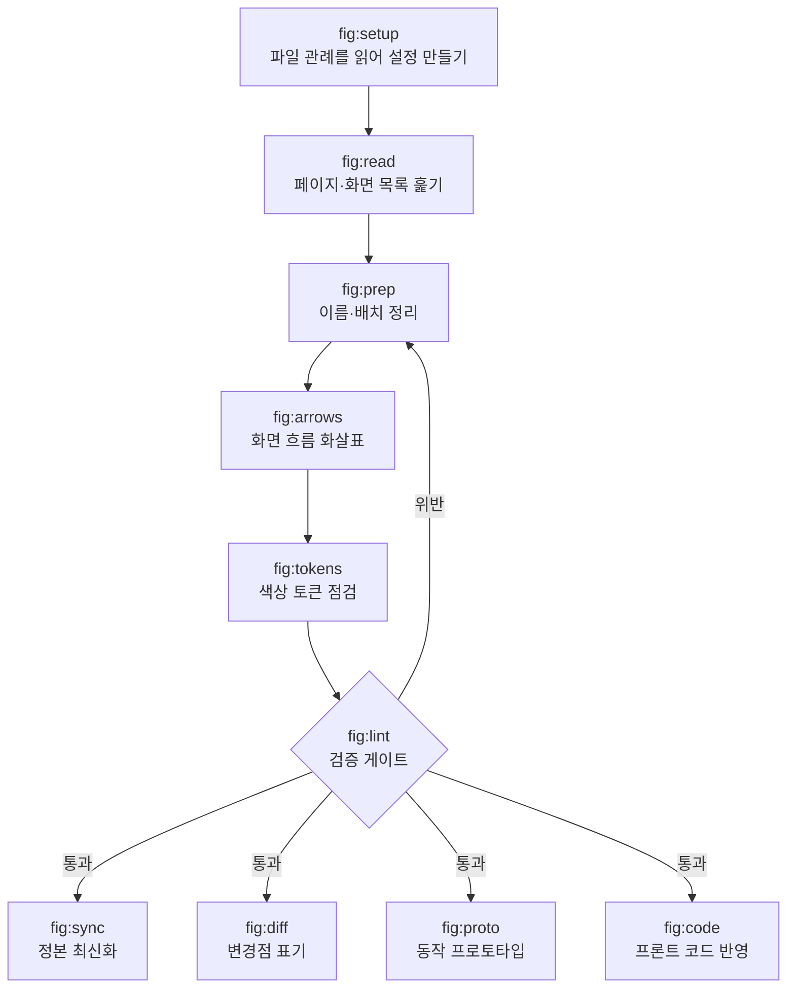

# fig

**한국어** · [English](README.en.md)

Claude Code에서 Figma 파일을 정리·검증·동기화하는 스킬 묶음. 화면을 새로 만드는 쪽이 아니라, 여러 사람이 함께 쓰는 파일을 관리하는 쪽입니다.

공식 Figma 플러그인(`figma-use`·`figma-generate-design`)이 **생성**을 맡는다면 이쪽은 **운영**을 맡습니다. 공식 플러그인 위에서 동작합니다.

```bash
claude plugin marketplace add byjunyoung/claude-figma-skills
claude plugin install fig@byjunyoung
```

---

## 왜 만들었나

디자인 파일은 혼자 쓰면 안 망가집니다. 문제는 사람이 여럿이고, 화면이 수백 개가 되고, 몇 달이 지났을 때 생깁니다.

- 화면을 복사해 새로 만들었는데 **원본에 있던 설정이 딸려와** 빈 자리가 렌더됩니다. 축소된 화면에선 안 보여서 개발이 물어볼 때까지 모릅니다
- 개발은 이미 배포됐는데 **Figma 정본은 옛날 그대로**입니다. 다음 사람이 옛 화면을 보고 기획합니다
- 화면을 옮기면 **흐름 화살표가 어긋납니다.** 손으로 다시 그리기 귀찮아서 그냥 둡니다
- "이 경우엔 뭐가 나오나요?" 개발이 묻습니다. **그 화면을 안 그렸다는 걸 그때 압니다**

전부 눈으로는 안 잡히고, 잡히더라도 고칠 때쯤엔 이미 늦은 것들입니다. 이 묶음은 그걸 **수치로 검사해서 미리** 잡습니다.

## 설계 원칙 셋

**검증은 한 곳에서만 합니다.** 파일을 고치는 스킬(`prep`·`arrows`·`sync`)에는 검사 코드가 없습니다. 맞는지 틀린지 판정하는 것은 `/fig:lint` 하나뿐이고, 나머지는 지적된 것을 고치는 역할만 맡습니다. 검증이 스킬마다 흩어져 있으면 "이번엔 그 스킬을 안 써서 검사를 건너뛰었다"는 구멍이 생기기 때문입니다.

**규칙은 묻지 않고 관측합니다.** 팀마다 화면 이름 붙이는 법도, 간격도, 섹션 묶는 단위도 다릅니다. `/fig:setup`은 그걸 물어보지 않고 **파일을 직접 훑어서 알아냅니다.** 사람은 자기 팀 규칙도 기억으로 답하면 틀리기 때문입니다.

**모르면 비워둡니다.** 관측 결과가 애매하면(표본이 적거나 값이 반반으로 갈리면) 채우지 않고 `null`로 둡니다. `null`은 그 검사를 건너뛴다는 뜻입니다. 규칙을 모르는 것과 규칙을 어긴 것은 다르고, 둘을 섞으면 리포트가 오탐에 묻혀 아무도 안 읽게 됩니다.

## 전체 흐름



---

## 이럴 때 씁니다

### 처음 보는 파일에서 시작할 때

```
/fig:setup    파일을 훑어 그 팀의 관례를 뽑아 설정 초안을 만든다
/fig:read     페이지와 화면 목록을 전부 수집한다
```

관례를 모르는 상태로 검사부터 돌리면 전건이 위반으로 나옵니다. 설정을 먼저 만드는 이유입니다. 초안이 나오면 `/fig:lint`를 한 번 돌려 **오탐률로 검증합니다** — 위반이 전건에 가까우면 파일이 엉망인 게 아니라 설정이 틀린 것입니다.

### 새 기능 화면을 다 그리고 개발에 넘기기 전

```
/fig:prep     이름 통일 · 기능 단위로 섹션에 배치 · 빠진 화면을 점선 껍데기로 채움
/fig:arrows   화면 사이 흐름을 화살표와 라벨로 연결
/fig:lint     구조 · 흐름 · 컴포넌트를 한 번에 검사
```

`prep`이 "목록 화면은 있는데 결과 없을 때 화면이 없다"를 찾아 자리를 잡아둡니다. 개발이 물어보기 전에 드러나는 게 핵심입니다. `lint`가 통과해야 넘깁니다.

### 기존 화면을 복사해 새 화면을 만들었을 때

```
/fig:lint     복사본이 물고 온 컴포넌트 기본값 잔재를 검출
```

라이브러리에서 켜져 있는 표시 토글이 그 화면에서 안 쓰여도 켜진 채 남아, 내용 없는 빈 자리가 렌더됩니다. **축소된 스크린샷에선 절대 안 보입니다.** 같은 파일의 기존 화면들이 그 컴포넌트를 어떻게 쓰는지 분포를 뽑아 대조하는 방식이라, 규칙 문서가 없어도 동작합니다.

### 릴리즈는 나갔는데 Figma 정본이 옛날일 때

```
/fig:sync     작업분이 정본에 반영됐는지 전수 대조 → 반영 → 아카이브 이관
```

작업본과 정본의 **화면 이름이 똑같아서** 이름 비교로는 뭐가 빠졌는지 알 수 없습니다. 화면 안의 글자, 화면 높이, 컴포넌트 연결 세 가지를 함께 보고 판정합니다. 구조가 같으면 화면을 통째로 옮기지 않고 값만 고쳐서, 기획서나 티켓에 걸린 링크가 안 끊기게 합니다.

### 기존 화면을 고치는 일감이라 변경점을 전달해야 할 때

```
/fig:diff     바뀐 요소에 개발 모드 주석 핀 + 일감 문서에 비교표
```

대표 화면에만 표시하고 상태 변형은 상속시킵니다. 변형마다 핀을 박으면 개발이 뭐가 진짜 변경인지 못 찾습니다.

### 개발 착수 전에 흐름이 말이 되는지 확인하고 싶을 때

```
/fig:proto    시안을 실제로 입력·저장되는 단일 HTML로 재현
```

화면을 클릭해 넘기는 데모가 아니라, 값을 넣고 저장하면 목록에 반영되는 물건입니다. 눌러보면 "이 순서가 이상한데" 같은 게 시안에서는 안 보이던 게 드러납니다.

### 시안을 코드에 반영할 때

```
/fig:code     대조표 → 최소 수정 → 기계 검증 · 브라우저 · 스크린샷 대조 → PR
```

시안이 기준인 것(수치·색·문구·상태)과 코드가 기준인 것(파일 구조·이름 짓는 방식·상태 관리)을 갈라서, 어느 한쪽이 다른 쪽을 덮어쓰지 않게 합니다.

---

## 스킬

| 명령 | 무엇을 |
|---|---|
| `/fig:setup` | 파일 관례를 관측해 설정 초안 생성 |
| `/fig:read` | 페이지·화면 목록 수집 |
| `/fig:prep` | 이름 통일 · 섹션 배치 · 누락 화면 placeholder |
| `/fig:arrows` | 흐름 화살표 생성과 재동기화 |
| `/fig:lint` | 읽기 전용 검증 게이트 (쓰기 0) |
| `/fig:tokens` | 색상의 디자인시스템 토큰 바인딩 검수 |
| `/fig:sync` | 정본 반영 전수 감사 → 반영 → 이관 |
| `/fig:diff` | 변경점 주석 표기 · 일감 문서 정리 |
| `/fig:proto` | 동작하는 단일 HTML 프로토타입 |
| `/fig:code` | 프론트엔드 레포 코드 반영 |

### `/fig:lint` 가 보는 것

| 무엇을 | 어떤 문제를 잡나 |
|---|---|
| 구조 | 화면이 섹션 밖으로 빠짐 · 섹션 경계 이탈 · 화면끼리 겹침 · 이름 규칙 위반 · 섹션 순번과 배치 불일치 |
| 흐름 | 화살표가 엉뚱한 화면을 관통 · 화살촉이 허공을 가리킴 · 어떤 흐름에도 안 걸린 화면 · 라벨이 화살촉이나 다른 선을 가림 |
| 컴포넌트 | 복사할 때 딸려온 불필요한 설정이 남아 빈자리가 렌더됨 |

화살촉 방향은 거리만 재면 안 잡힙니다. 12px 떨어져 있어도 도착 변에 **평행하면** 화살촉이 옆 허공을 가리킵니다. 그래서 마지막 선분이 도착 변에 수직인지를 따로 봅니다.

---

## 설치

```bash
claude plugin marketplace add byjunyoung/claude-figma-skills
claude plugin install fig@byjunyoung
```

갱신은 `claude plugin marketplace update byjunyoung` 한 줄입니다.

- **필요한 것** — Claude Code, Figma MCP 플러그인(`plugin:figma`), `python3` + PyYAML, `node`
- **설치 확인** — `claude plugin list` 에 `fig@byjunyoung` 이 보이면 됩니다
- **설치 뒤** — 대상 파일에서 `/fig:setup` 을 먼저 돌려 설정을 만드세요

## 설정

규칙은 스킬 문서가 아니라 `figma-conventions.yaml` 하나가 정합니다. 화면 이름 규칙, 상태 목록, 간격 값, 섹션 스타일, 화살표 스타일, 검사에서 뺄 섹션, 허용 오차가 모두 여기 있습니다.

```
./figma-conventions.yaml              프로젝트별 (있으면 이걸 씀)
      ↓ 없으면
~/.claude/figma-conventions.yaml      내 공통 설정
      ↓ 없으면
플러그인 내장 기본값                    → 리포트에 "기본값으로 진행" 표시
```

- **첫 실행** — 대상 파일에서 `/fig:setup`을 돌리면 관례를 관측해 초안을 만듭니다
- **`null`의 의미** — 추정하지 않았다는 뜻이고, 해당 검사를 건너뜁니다
- **파일별 설정** — 정본·아카이브 페이지 구분처럼 파일마다 다른 항목은 `files.<fileKey>`에 적습니다

## 구조

```
.claude-plugin/
  plugin.json                플러그인 이름·버전·author
  marketplace.json           마켓플레이스 항목
skills/
  setup  read  prep  arrows  lint
  tokens sync  diff  proto   code      각 SKILL.md
_figma-common/
  conventions.example.yaml   설정 스키마 + 내장 기본값
  verify.py                  정합성 검사
  scripts/
    audit-struct.js          소속·경계·겹침·네이밍·순번
    audit-flow.js            화살표 수치·진입방향·관통·라벨·커버리지
    audit-component.js       컴포넌트 기본값 잔재
    arrow-build.js           화살표 생성 헬퍼
    prep-ops.js              페이지 정리 헬퍼
    probe-page.js            관례 관측
    lib/                     설정 해석·초안 생성·문법 검사
```

Figma 플러그인은 파일 시스템에 접근할 수 없습니다. 그래서 설정 해석은 로컬에서 처리하고, `resolve-config.py --js <fileKey>` 가 출력한 한 줄을 스크립트 앞에 붙여 실행합니다. 스크립트 경로는 `${CLAUDE_PLUGIN_ROOT}` 기준입니다 — 설치 위치가 환경마다 다르기 때문입니다.

스킬을 수정한 뒤에는 `python3 ${CLAUDE_PLUGIN_ROOT}/_figma-common/verify.py` 로 정합성을 확인합니다.

## 기술 스택

Claude Code 스킬(Markdown) + Figma Plugin API(JavaScript) + 설정 해석·집계(Python). 외부 의존성은 PyYAML 하나입니다.

## 만든 사람

김준영 · [LinkedIn](https://www.linkedin.com/in/byjunyoung/)

## 라이선스

© 2026 Junyoung Kim · [LICENSE](LICENSE)

**설치해서 쓰시는 건 자유입니다.** 개인이든 팀 안에서든 마음껏 쓰시고, 필요하면 고쳐 쓰셔도 됩니다.

다만 **포크해서 재배포하거나, 자기 이름으로 다시 배포하거나, 상업적으로 재판매하는 것은 허락이 필요합니다.** 정식 오픈소스 라이선스를 붙이지 않은 이유가 그것입니다. 필요하시면 [Issues](https://github.com/byjunyoung/claude-figma-skills/issues)나 링크드인으로 문의해 주세요.

## 피드백

버그 제보나 기능 제안은 [Issues](https://github.com/byjunyoung/claude-figma-skills/issues)에 남겨주세요.
