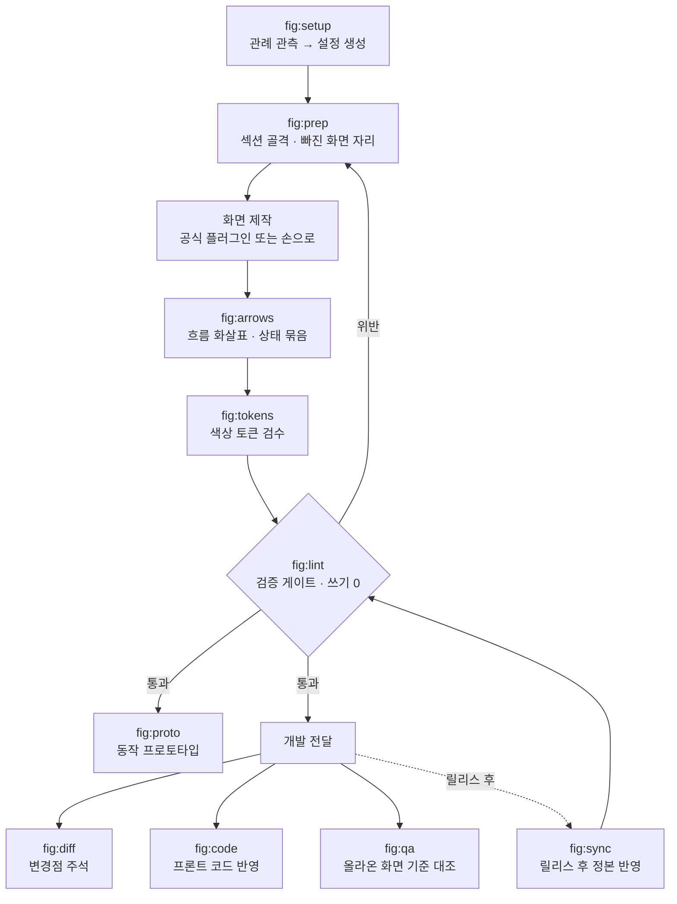

# fig

**한국어** · [English](README.en.md)

Claude Code에서 Figma 파일을 정리·검증·동기화하는 스킬 묶음.

```bash
claude plugin marketplace add byjunyoung/claude-figma-skills
claude plugin install fig@byjunyoung
```

[어떤 자리에 서는 도구인가](#어떤-자리에-서는-도구인가) · [누가 쓰면 좋은가](#누가-쓰면-좋은가) · [무엇을 해결하나](#무엇을-해결하나) · [어떻게 쓰나](#어떻게-쓰나) · [스킬 열한 개](#스킬-열한-개) · [설치](#설치) · [설정](#설정) · [설계 원칙](#설계-원칙)

---

## 어떤 자리에 서는 도구인가

Figma를 다루는 도구는 크게 둘로 갈립니다. 화면을 그려내는 쪽과, 그려둔 파일을 관리하는 쪽.

공식 Figma 플러그인(`figma-use`, `figma-generate-design`, `figma-generate-library`)이 앞쪽입니다. 코드나 설명을 받아 화면과 컴포넌트를 만들어냅니다.

이 묶음은 뒤쪽입니다. 이미 있는 파일을 대상으로 이름이 규칙에 맞는지, 화면이 제자리에 있는지, 흐름 화살표가 실제로 이어지는지, 개발에 나간 변경이 정본에 반영됐는지를 검사하고 고칩니다. 공식 플러그인 위에서 동작하니 둘을 같이 씁니다.

그리는 일은 공식 플러그인이, 그린 다음은 이 묶음이 맡습니다.

## 누가 쓰면 좋은가

파일 하나를 여러 사람이 오래 고쳐 쓰는 팀에 맞습니다. 새로 그리는 작업이든 그려둔 것을 고치는 작업이든 상관없습니다.

- 화면이 수백 개 쌓인 파일을 여럿이 함께 고치는 팀
- 새 기능 화면을 한 벌 그려 개발에 넘기는 사이클이 반복되는 자리
- 개발에 넘긴 시안과 Figma 정본을 계속 맞춰야 하는 자리
- 파일 관리 규칙은 있는데 지켜지는지 확인할 방법이 없는 팀

새로 그리는 작업에서는 이렇게 붙습니다. 화면 안을 그리는 것은 공식 플러그인이 맡고, 이 묶음은 그 앞뒤를 맡습니다.

```
그리기 전   섹션 골격을 잡고, 빠진 상태를 점선 껍데기로 세워 그릴 목록을 만든다
그리는 중   화면을 복제해 변형을 만들 때 딸려온 설정 잔재를 검출한다
다 그린 뒤  전환 화살표와 상태 묶음을 연결하고, 검사를 통과해야 넘긴다
```

안 맞는 경우도 적어둡니다.

- 화면 한두 장짜리 단발 작업이면 손으로 하는 편이 빠릅니다
- 컴포넌트 라이브러리를 처음부터 만드는 일은 공식 `figma-generate-library` 쪽입니다
- 규칙이 아직 없는 팀은 `/fig:setup`이 관례를 못 뽑습니다. 먼저 몇 가지를 정하는 편이 낫습니다

## 무엇을 해결하나

디자인 파일은 혼자 쓰면 잘 안 망가집니다. 문제는 사람이 여럿이고, 화면이 수백 개가 되고, 몇 달이 지났을 때 생깁니다. 네 가지가 반복됩니다.

- **복제 잔재** — 화면을 복제해 새로 만들면 원본 설정이 딸려옵니다. 안 쓰는 표시 토글이 켜진 채 남아 내용 없는 빈 자리가 렌더됩니다. 축소된 화면에서는 보이지 않습니다
- **정본 지연** — 개발은 이미 배포됐는데 Figma 정본은 옛날 그대로입니다. 다음 사람이 옛 화면을 보고 기획합니다
- **어긋난 화살표** — 화면을 옮기면 흐름 화살표가 따라오지 않습니다. 손으로 다시 그리는 비용 때문에 그냥 둡니다
- **안 그린 화면** — "이 경우엔 뭐가 나오나요?" 개발이 물어서야 그 화면을 안 그렸다는 것을 압니다

네 가지 다 눈으로는 안 잡힙니다. 잡히더라도 고칠 때쯤이면 이미 개발이 물어본 뒤입니다. 이 묶음은 그것을 수치로 검사해 미리 잡습니다.

---

## 어떻게 쓰나

세 가지 리듬으로 씁니다. 기능 하나를 그려 넘기는 한 사이클, 릴리스마다 도는 정본 맞추기, 그리고 아무 때나 돌리는 건강검진.

### 한 사이클 — 기능 하나를 그려 넘길 때까지

```
/fig:setup    처음 여는 파일이면 관례를 관측해 설정 초안을 만든다
/fig:prep     섹션 골격을 잡고, 빠진 상태를 점선 껍데기로 세운다
   ·          화면을 그린다 (공식 플러그인 또는 손으로)
/fig:arrows   전환 화살표와 상태 묶음을 연결한다
/fig:lint     구조 · 흐름 · 컴포넌트를 한 번에 검사한다
/fig:diff     기존 화면을 고친 일감이면 변경점에 주석 핀을 박는다
```

`prep`이 먼저 오는 이유는 그릴 목록을 만들기 위해서입니다. 목록 화면을 그리면 결과 없을 때 화면이 필요하고, 폼을 그리면 검증 실패 화면이 필요합니다. 이것을 점선 껍데기로 먼저 세워두면 빠진 화면이 눈에 보입니다. 개발이 물어보기 전에 드러나는 것이 핵심입니다.

`lint`는 통과해야 넘기는 관문입니다. 파일을 쓰지 않으니 몇 번을 돌려도 안전합니다.

### 주기 작업 — 릴리스가 나간 뒤 정본 맞추기

```
/fig:sync     작업분이 정본에 반영됐는지 전수 대조 → 반영 → 아카이브 이관
```

작업본과 정본은 화면 이름이 똑같아서 이름 비교로는 뭐가 빠졌는지 알 수 없습니다. 화면 안의 글자, 화면 높이, 컴포넌트 연결 세 가지를 함께 보고 판정합니다.

구조가 같으면 화면을 통째로 옮기지 않고 값만 고칩니다. 노드 id가 유지돼 기획서나 티켓에 걸어둔 딥링크가 안 끊깁니다.

### 수시 — 파일 건강검진

```
/fig:lint     구조 · 흐름 · 컴포넌트 검사 (쓰기 0)
/fig:tokens   색이 디자인시스템 토큰에 묶여 있는지 검수
```

파일을 안 고치니 아무 때나 돌려도 됩니다. 남이 만진 파일을 넘겨받았을 때, 오래된 파일을 다시 열었을 때 먼저 한 번 돌려보면 상태를 알 수 있습니다.

### 곁가지 두 개

```
/fig:proto    개발 착수 전, 시안을 실제로 입력 · 저장되는 단일 HTML로 재현
/fig:code     시안을 프론트엔드 레포에 반영
/fig:qa       올라온 화면을 기획 기준과 대조해 결함 리포트
```

`proto`는 화면을 클릭해 넘기는 데모가 아닙니다. 값을 넣고 저장하면 목록에 반영됩니다. 눌러보면 시안에서는 안 보이던 순서 문제가 드러납니다.

`qa`는 개발 서버에 올라온 화면을 기획 기준과 대조합니다. "이상해 보인다"가 아니라 "어느 문서의 어느 규칙에 어긋난다"로 적는 게 원칙이라, 기준이 없는 항목은 결함이 아니라 확인 필요로 분리합니다.

`code`는 시안이 기준인 것(수치·색·문구·상태)과 코드가 기준인 것(파일 구조·이름 짓는 방식·상태 관리)을 갈라서, 어느 한쪽이 다른 쪽을 덮어쓰지 않게 합니다.

### 전체 흐름



---

## 스킬 열한 개

| 명령 | 무엇을 |
|---|---|
| `/fig:setup` | 파일 관례를 관측해 설정 초안 생성 |
| `/fig:read` | 페이지·화면 목록 수집 |
| `/fig:prep` | 이름 통일 · 섹션 배치 · 누락 화면 placeholder |
| `/fig:arrows` | 흐름 화살표 생성과 재동기화 |
| `/fig:lint` | 읽기 전용 검증 게이트 (쓰기 0) |
| `/fig:tokens` | 색상의 디자인시스템 토큰 바인딩 검수 |
| `/fig:sync` | 정본 반영 전수 감사 → 반영 → 이관 |
| `/fig:diff` | 변경점 주석 표기 · 일감 문서 정리 |
| `/fig:proto` | 동작하는 단일 HTML 프로토타입 |
| `/fig:code` | 프론트엔드 레포 코드 반영 |
| `/fig:qa` | 올라온 화면을 기획 기준과 대조해 결함 리포트 |

### `/fig:lint`가 보는 것

| 무엇을 | 어떤 문제를 잡나 |
|---|---|
| 구조 | 화면이 섹션 밖으로 빠짐 · 섹션 경계 이탈 · 화면끼리 겹침 · 이름 규칙 위반 · 섹션 순번과 배치 불일치 |
| 흐름 | 화살표가 엉뚱한 화면을 관통 · 화살촉이 허공을 가리킴 · 어떤 흐름에도 안 걸린 화면 · 라벨이 화살촉이나 다른 선을 가림 |
| 컴포넌트 | 복제할 때 딸려온 불필요한 설정이 남아 빈자리가 렌더됨 |

화살촉 방향은 거리만 재면 안 잡힙니다. 12px 떨어져 있어도 도착 변에 평행하면 화살촉이 옆 허공을 가리킵니다. 그래서 마지막 선분이 도착 변에 수직인지를 따로 봅니다.

컴포넌트 검사는 규칙 문서가 없어도 동작합니다. 같은 파일의 기존 화면들이 그 컴포넌트를 어떻게 쓰는지 분포를 뽑아 대조하는 방식입니다.

---

## 설치

```bash
claude plugin marketplace add byjunyoung/claude-figma-skills
claude plugin install fig@byjunyoung
```

갱신은 `claude plugin marketplace update byjunyoung` 한 줄입니다.

- **필요한 것** — Claude Code, Figma MCP 플러그인(`plugin:figma`), `python3` + PyYAML, `node`
- **설치 확인** — `claude plugin list`에 `fig@byjunyoung`이 보이면 됩니다
- **설치 뒤** — 대상 파일에서 `/fig:setup`을 먼저 돌려 설정을 만듭니다

## 설정

규칙은 스킬 문서가 아니라 `figma-conventions.yaml` 하나가 정합니다. 화면 이름 규칙, 상태 목록, 간격 값, 섹션 스타일, 화살표 스타일, 검사에서 뺄 섹션, 허용 오차가 모두 여기 있습니다.

```
./figma-conventions.yaml              프로젝트별 (있으면 이걸 씀)
      ↓ 없으면
~/.claude/figma-conventions.yaml      내 공통 설정
      ↓ 없으면
플러그인 내장 기본값                    → 리포트에 "기본값으로 진행" 표시
```

전체 스키마는 [`conventions.example.yaml`](_common/conventions.example.yaml)에 있습니다. 14개 절, 112개 항목이고 값마다 무엇을 검사하는지 주석이 붙어 있어 그대로 복사해 고쳐 쓰면 됩니다. 생긴 모양은 이렇습니다.

```yaml
naming:
  frame: "{screen}-{state}"           # 사람이 읽을 형태
  frame_pattern: '^.+-[^-\s]+$'       # lint 가 그대로 정규식으로 쓴다
  states: [Default, Empty, Loading, Error, Validation, Selected]
  required_states:
    list: [Default, Empty, Loading, Error]

pages:
  strict:   ['^\[UI\] ']              # 규칙 전면 적용
  exclude_sections: ['^템플릿$']       # 검사 면제

layout:
  column_grid: 1560
  frame_gap: 120

arrows:
  color: "#4A5463"
  audit: { edge_tolerance: 2, gap_range: [9, 15] }
```

- **첫 실행** — 대상 파일에서 `/fig:setup`을 돌리면 관례를 관측해 초안을 만듭니다
- **`null`의 의미** — 추정하지 않았다는 뜻이고, 해당 검사를 건너뜁니다
- **파일별 설정** — 정본·아카이브 페이지 구분처럼 파일마다 다른 항목은 `files.<fileKey>`에 적습니다

초안이 나오면 `/fig:lint`를 한 번 돌려 오탐률로 검증합니다. 위반이 전건에 가까우면 파일이 잘못된 게 아니라 설정이 틀린 것입니다.

---

## 설계 원칙

**검증은 한 곳에서만 합니다.** 파일을 고치는 스킬(`prep`·`arrows`·`sync`)에는 검사 코드가 없습니다. 맞는지 틀린지 판정하는 것은 `/fig:lint` 하나뿐이고, 나머지는 지적된 것을 고치는 역할만 맡습니다. 검증이 스킬마다 흩어져 있으면 "이번엔 그 스킬을 안 써서 검사를 건너뛰었다"는 구멍이 생기기 때문입니다.

**규칙은 묻지 않고 관측합니다.** 팀마다 화면 이름 붙이는 법도, 간격도, 섹션 묶는 단위도 다릅니다. `/fig:setup`은 그것을 물어보지 않고 파일을 직접 훑어서 알아냅니다. 사람은 자기 팀 규칙도 기억으로 답하면 틀리기 때문입니다.

**모르면 비워둡니다.** 관측 결과가 애매하면, 즉 표본이 적거나 값이 반반으로 갈리면 채우지 않고 `null`로 둡니다. `null`은 그 검사를 건너뛴다는 뜻입니다. 규칙을 모르는 것과 규칙을 어긴 것은 다르고, 둘을 섞으면 리포트가 오탐에 묻혀 아무도 안 읽게 됩니다.

## 구조

```
.claude-plugin/
  marketplace.json             마켓플레이스 항목 (플러그인 목록)
plugins/
  fig/
    .claude-plugin/plugin.json
    README.md
    skills/
      setup  read  prep  arrows  lint
      tokens sync  diff  proto   code    각 SKILL.md
    _common/
      conventions.example.yaml           설정 스키마 + 내장 기본값
      scripts/
        audit-struct.js                  소속·경계·겹침·네이밍·순번
        audit-flow.js                    화살표 수치·진입방향·관통·라벨·커버리지
        audit-component.js               컴포넌트 기본값 잔재
        arrow-build.js                   화살표 생성 헬퍼
        prep-ops.js                      페이지 정리 헬퍼
        probe-page.js                    관례 관측
        lib/                             설정 해석·초안 생성·문법 검사
tools/
  verify.py                    정합성 검사 (저장소 도구, 설치본에는 안 실림)
```

한 저장소가 플러그인 여럿을 담습니다. `marketplace.json`의 `plugins`가 배열이라, 설치는 따로 가면서 저장소·검사기는 한 벌만 관리합니다.

Figma 플러그인은 파일 시스템에 접근할 수 없습니다. 그래서 설정 해석은 로컬에서 처리하고, `resolve-config.py --js <fileKey>`가 출력한 한 줄을 스크립트 앞에 붙여 실행합니다. 스크립트 경로는 `${CLAUDE_PLUGIN_ROOT}` 기준입니다. 설치 위치가 환경마다 다르기 때문입니다.

스킬을 수정한 뒤에는 저장소에서 `python3 tools/verify.py`로 정합성을 확인합니다. 마켓플레이스에 등록된 플러그인을 전부 검사하고, 플러그인 사이에 사본으로 도는 파일이 갈렸는지도 함께 봅니다.

## 기술 스택

Claude Code 스킬(Markdown) + Figma Plugin API(JavaScript) + 설정 해석·집계(Python). 외부 의존성은 PyYAML 하나입니다.

## 만든 사람

김준영 · [LinkedIn](https://www.linkedin.com/in/byjunyoung/)

## 라이선스

© 2026 Junyoung Kim · [LICENSE](LICENSE)

설치해서 쓰는 것은 자유입니다. 개인이든 팀 안에서든 쓰고, 필요하면 고쳐 써도 됩니다.

포크해서 재배포하거나, 다른 이름으로 다시 배포하거나, 상업적으로 재판매하는 것은 허락이 필요합니다. 정식 오픈소스 라이선스를 붙이지 않은 이유입니다. 문의는 [Issues](https://github.com/byjunyoung/claude-figma-skills/issues)나 링크드인으로 남겨주세요.

## 피드백

버그 제보나 기능 제안은 [Issues](https://github.com/byjunyoung/claude-figma-skills/issues)에 남겨주세요.
